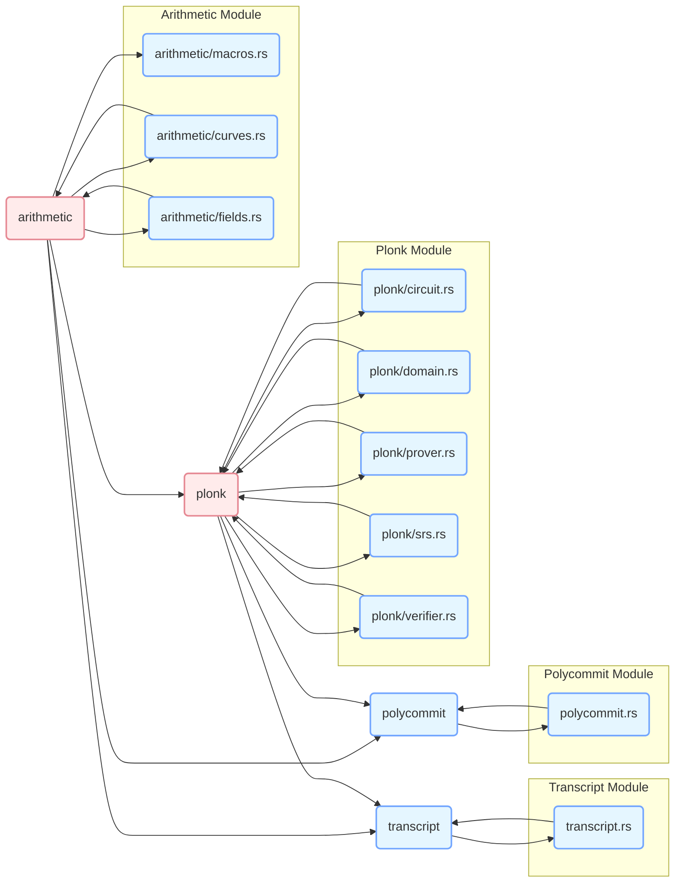
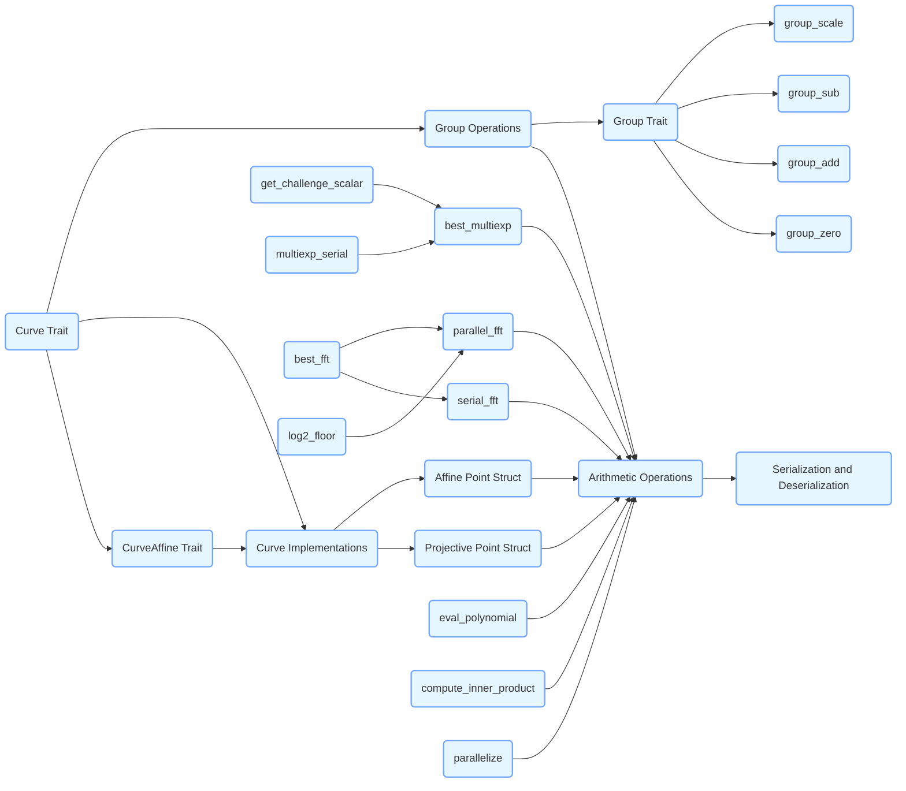

# Introduction
You can copy any mermaid code from this document and paste it into the [mermaid live editor](https://mermaid-js.github.io/mermaid-live-editor/) to visualize the flowchart.

# overall-architecture-flowchart

# arithmetic-curve
