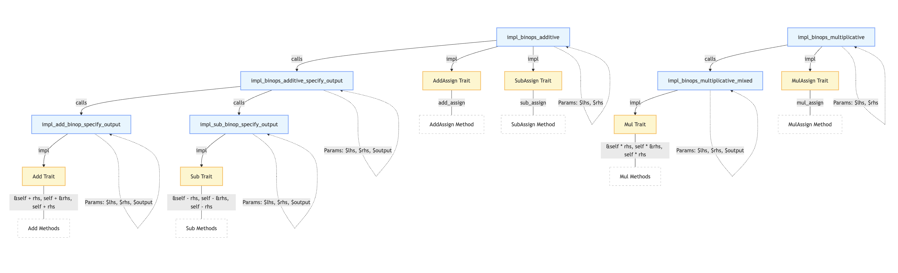
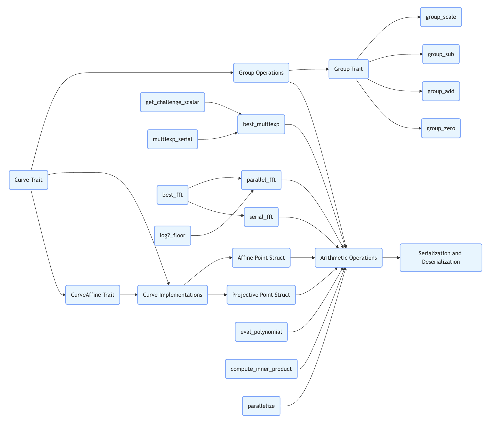

# Introduction
This Rust codebase provides an implementation of a variant of (Turbo)[PLONK] designed specifically for the [polynomial commitment scheme](../theory/arithmetic.md#polynomial-commitment-scheme) described in the [Halo] paper. PLONK (Permutations over Lagrange-bases for Oecumenical Noninteractive arguments of Knowledge) is a zero-knowledge proof system that allows a prover to convince a verifier that a certain computation has been carried out correctly without revealing the details of the computation. The polynomial commitment scheme is a fundamental building block in many cryptographic protocols, enabling the prover to commit to a [polynomial](../theory/arithmetic.md#polynomials-in-cryptography-definition-and-examples) and later prove evaluations of the polynomial at specific points.

# Overall Architecture
## Flowchart
[mermaid source code](../appendix/code/mermaid.md#overall-architecture-flowchart)

## Explanation:
* The `arithmetic` module is a core module that provides common utilities, traits, and structures for [group](../theory/arithmetic.md#group), [field](../theory/arithmetic.md#field-theory), and [polynomial](../theory/arithmetic.md#polynomials-in-cryptography-definition-and-examples) arithmetic. It includes sub-modules such as `macros.rs`, `curves.rs`, and `fields.rs`.
* The `plonk` module implements a variant of (Turbo)`plonk`. It depends on the `arithmetic` module and has sub-modules for [circuit synthesis](../theory/arithmetic.md#circuit-synthesis), [domain operations](../theory/arithmetic.md#domain-operations), prover, [structured reference string (SRS)](../theory/arithmetic.md#structured-reference-string-srs) generation, and verifier.
* The `polycommit` module is related to [polynomial commitment schemes](../theory/arithmetic.md#polynomial-commitment-scheme) and depends on the `arithmetic` module.
* The `transcript` module is used for hashing and absorbing values and also depends on the `arithmetic` module. The `plonk` module also uses both the `polycommit` and `transcript` modules.

## Detailed Module Relationships
### arithmetic
#### **1. macros.rs**
Defines Rust macros to implement binary operations for different types, reducing code duplication.   
     
The flowchart above visualizes the hierarchical structure of Rust macros that automate the implementation of arithmetic traits. 
* `impl_binops_additive`: Extends impl_binops_additive_specify_output to include assignment operations (+=, -=).
* `impl_binops_multiplicative`: Extends impl_binops_multiplicative_mixed to include multiplication assignment (*=).
* [rust syntx for these macros](../rust-syntax/macros.md#macros-in-arithmetic-module)

#### **2. curves.rs**
Defines trait methods for curve elements, such as converting to [affine form](../theory/arithmetic.md#affine-form), [doubling](../theory/arithmetic.md#doubling), and [getting coordinates](../theory/arithmetic.md#getting-coordinates).

* [mermaid source code](../appendix/code/mermaid.md#arithmetic-curve)

The `src/arithmetic/curves.rs` file provides implementations for the [Tweedledum and Tweedledee elliptic curve groups](../theory/arithmetic.md#tweedledum-and-tweedledee-elliptic-curve-groups). The `Curve` and `CurveAffine` abstractions allow the code to generalize over these two groups, enabling efficient and generic arithmetic operations on elliptic curve points.

##### 2.1 `Curve` Trait
- **Function**: Defines a common interface for dealing with elements of an elliptic curve group in the "projective" form, where arithmetic operations are usually more efficient.
- **Implementation Principle**:
    - **Associated Types**:
        - `type Affine`: Represents the [affine form](../theory/arithmetic.md#affine-form) of a point on the curve.
        - `type Scalar`: Represents the [scalar field of the elliptic curve](../theory/arithmetic.md#scalar-field-in-elliptic-curve-cryptography).
        - `type Base`: Represents the [base field over which the elliptic curve is constructed](../theory/arithmetic.md#base-field).
    - **Methods**:
        - `fn zero() -> Self;`: Returns the additive identity of the curve group.
        - `fn one() -> Self;`: Returns the base point of the curve.
        - `fn double(&self) -> Self;`: Doubles the current curve point.
        - `fn is_zero(&self) -> Choice;`: Checks if the current point is the identity element.
        - `fn endo(&self) -> Self;`: Applies the curve endomorphism by multiplying the x - coordinate by an element of multiplicative order 3.
        - `fn to_affine(&self) -> Self::Affine;`: Converts the projective point to its affine form.
        - `fn is_on_curve(&self) -> Choice;`: Checks if the point is on the curve.
        - `fn batch_to_affine(v: &[Self], target: &mut [Self::Affine]);`: Converts multiple projective points to their affine forms in batch.
        - `fn b() -> Self::Base;`: Returns the curve constant `b`.
- **Cryptographic Knowledge**: Elliptic curve groups are fundamental in modern cryptography, especially in public - key cryptography. The base point and scalar multiplication operations are used in key generation, digital signatures, and encryption algorithms. Endomorphisms can be used to speed up scalar multiplication operations.

##### 2.2 `CurveAffine` Trait
- **Function**: Serves as the affine counterpart to the `Curve` trait. It is used for serialization, storage in memory, and inspection of the $(x, y)$ coordinates of a point on the curve.
- **Implementation Principle**:
    - **Associated Types**:
        - `type Projective`: Represents the projective form of a point on the curve.
        - `type Scalar`: Represents the scalar field of the elliptic curve.
        - `type Base`: Represents the base field over which the elliptic curve is constructed.
    - **Methods**:
        - `fn zero() -> Self;`: Returns the additive identity of the curve group in affine form.
        - `fn one() -> Self;`: Returns the base point of the curve in affine form.
        - `fn is_zero(&self) -> Choice;`: Checks if the current point is the identity element.
        - `fn to_projective(&self) -> Self::Projective;`: Converts the affine point to its projective form.
        - `fn get_xy(&self) -> CtOption<(Self::Base, Self::Base)>;`: Gets the $(x, y)$ coordinates of the point.
        - `fn from_xy(x: Self::Base, y: Self::Base) -> CtOption<Self>;`: Creates a point from given $(x, y)$ coordinates, failing if the point is not on the curve.
        - `fn is_on_curve(&self) -> Choice;`: Checks if the point is on the curve.
        - `fn from_bytes(bytes: &[u8; 32]) -> CtOption<Self>;`: Attempts to obtain a group element from its compressed 32 - byte little - endian representation.
        - `fn to_bytes(&self) -> [u8; 32];`: Obtains the compressed, 32 - byte little - endian representation of the element.
        - `fn from_bytes_wide(bytes: &[u8; 64]) -> CtOption<Self>;`: Attempts to obtain a group element from its uncompressed 64 - byte little - endian representation.
        - `fn to_bytes_wide(&self) -> [u8; 64];`: Obtains the uncompressed, 64 - byte little - endian representation of the element.
        - `fn b() -> Self::Base;`: Returns the curve constant `b`.
- **Cryptographic Knowledge**: Affine points are more suitable for serialization and storage because they have a simpler representation. Compressed and uncompressed byte representations are used for efficient transmission and storage of elliptic curve points in cryptographic protocols.

##### 2.3 `new_curve_impl` Macro
- **Function**: Implements the `Curve` and related traits for a given curve type and its affine counterpart.
- **Implementation Principle**:
    - **Struct Definitions**:
        - Defines a `Projective` struct representing a point in the projective coordinate space and an `Affine` struct representing a point in the affine coordinate space.
    - **Trait Implementations**:
        - Implements the `Curve` trait for the `Projective` struct, including methods for obtaining the zero and one points, doubling a point, applying the endomorphism, converting to affine form, and checking if a point is on the curve.
        - Implements the `From` trait to convert between `Affine` and `Projective` forms.
        - Implements the `Default` and `ConstantTimeEq` traits for the `Projective` struct.
- **Cryptographic Knowledge**: This macro simplifies the implementation of elliptic curve groups, making it easier to work with different curves in a generic way. The use of projective coordinates can significantly improve the efficiency of arithmetic operations on elliptic curves.

#### **3. fields.rs**
Defines trait methods for field elements, including finding the [multiplicative inverse](../theory/arithmetic.md#multiplicative-inverse), obtaining the [square root](../theory/arithmetic.md#square-root), and [converting integers to field elements](../theory/arithmetic.md#converting-integers-to-field-elements).

### polycommit
* `OpeningProof`: Represents a proof object for the polynomial commitment scheme opening.
* `Params`: Contains the public parameters for the polynomial commitment scheme. It provides methods for initializing parameters, committing to polynomials, and creating opening proofs.
### plonk
* `circuit.rs`: Defines the interface for creating gates and circuits in the TurboPLONK protocol.
* `domain.rs`: Defines the EvaluationDomain struct, which contains precomputed constants for performing operations on an evaluation domain in the context of PLONK.
* `prover.rs`: Implements the prover side of the TurboPLONK protocol, including creating proofs.
* `srs.rs`: Defines the structured reference string (SRS), which is computed from a specific circuit and parameters for the polynomial commitment scheme.
* `verifier.rs`: Implements the verifier side of the TurboPLONK protocol, including verifying proofs.
### transcript
* Provides a transcript implementation for obtaining Fiat-Shamir challenges, which are used to convert an interactive zero-knowledge proof into a non-interactive one.