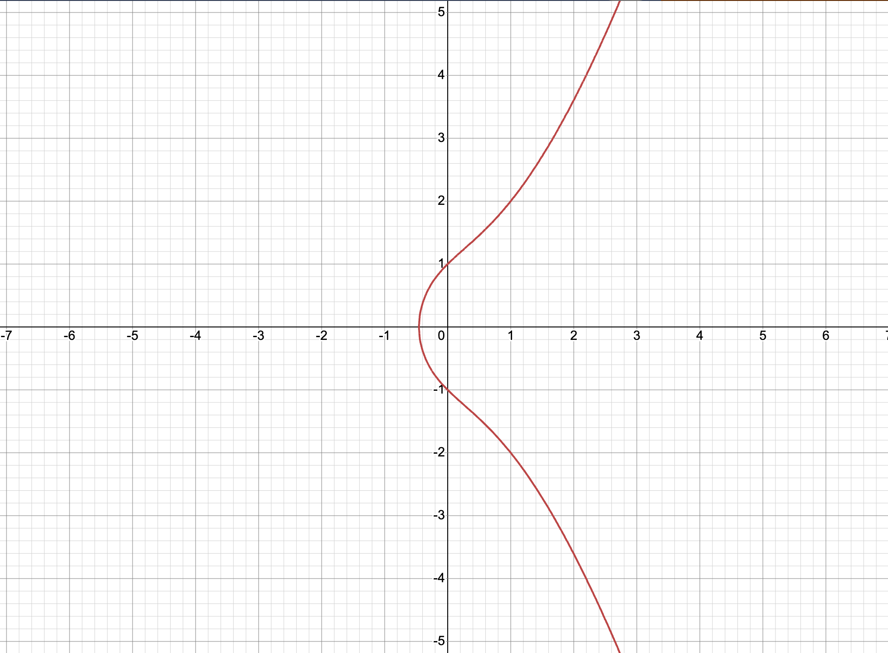
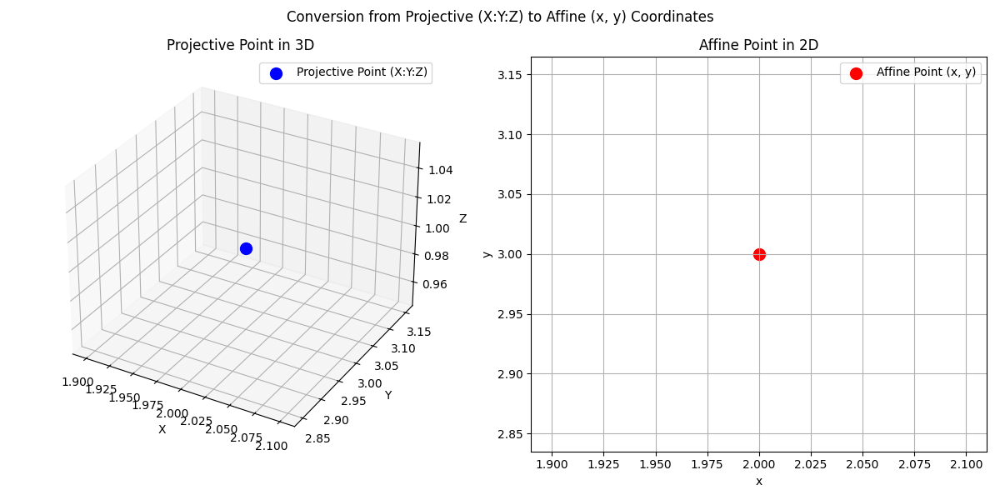
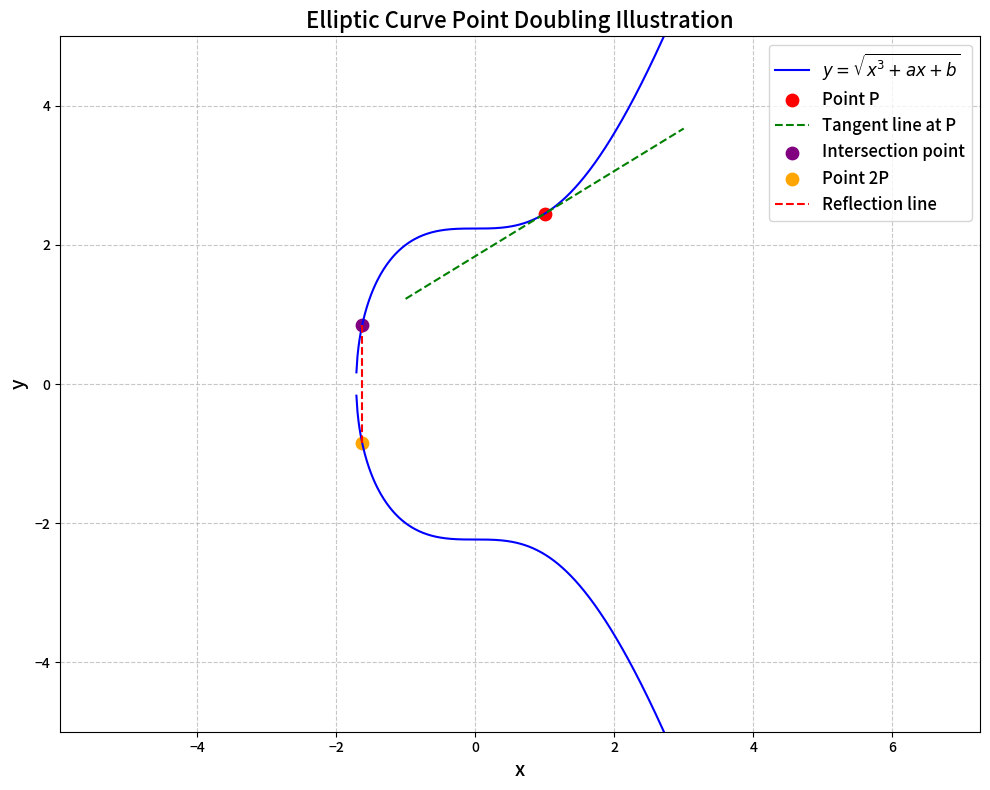
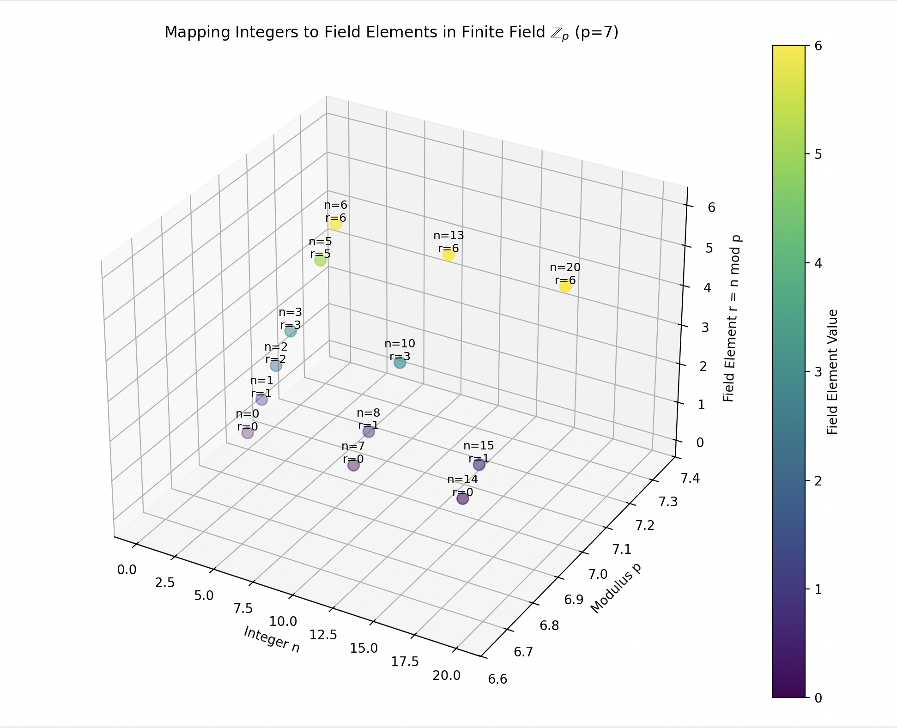

# Arithmetic Module
* Field Theory: Fields are a fundamental concept in cryptography. In a finite field, operations such as addition, subtraction, multiplication, and division (finding the multiplicative inverse) are well-defined. These operations are used in many cryptographic algorithms, such as elliptic curve cryptography and polynomial commitment schemes.
* Elliptic Curve Cryptography: Elliptic curves are widely used in modern cryptography due to their security and efficiency. Curve operations such as point addition, point doubling, and coordinate extraction are fundamental to elliptic curve cryptography. For example, the double-and-add algorithm, which uses the double operation, is commonly used to perform scalar multiplication on elliptic curves.
* Fast Fourier Transform (FFT): The FFT is an efficient algorithm for computing the discrete Fourier transform (DFT) of a sequence. In cryptography, the FFT is used in polynomial commitment schemes and other cryptographic protocols to perform polynomial evaluation and interpolation efficiently.
* Multi-Exponentiation: Multi-exponentiation is the operation of computing a linear combination of multiple exponentiations. In elliptic curve cryptography, multi-exponentiation is used to compute a point on the curve given a set of coefficients and bases. Parallelizing multi-exponentiation can significantly improve the performance of cryptographic operations.

## Field Theory

In the realm of cryptography, a field is a crucial algebraic structure that provides a set of elements along with two binary operations: addition and multiplication. These operations follow specific rules that endow the field with certain desirable properties.

### Definition and General Properties
A field $(F, +, \cdot)$ consists of a set $F$ and two operations:
 - **Addition**: The set $F$ forms an abelian (commutative) group under addition. This means it satisfies the following:
    - **Closure**: For any $a, b \in F$, $a + b \in F$.
    - **Associativity**: $(a + b)+c = a+(b + c)$ for all $a, b, c \in F$.
    - **Identity Element**: There exists an element $0 \in F$ such that $a + 0 = 0 + a = a$ for all $a \in F$.
    - **Inverse Element**: For every $a \in F$, there exists an element $-a \in F$ such that $a+(-a)=(-a)+a = 0$.
 - **Multiplication**: The non-zero elements of $F$, denoted as $F^*=F\setminus\{0\}$, form an abelian group under multiplication. So:
    - **Closure**: For any $a, b\in F^*$, $a\cdot b\in F^*$.
    - **Associativity**: $(a\cdot b)\cdot c = a\cdot(b\cdot c)$ for all $a, b, c\in F^*$.
    - **Identity Element**: There exists an element $1\in F^*$ such that $a\cdot 1 = 1\cdot a = a$ for all $a\in F^*$.
    - **Inverse Element**: For every $a\in F^*$, there exists an element $a^{-1}\in F^*$ such that $a\cdot a^{-1}=a^{-1}\cdot a = 1$.
 - **Distributivity**: For all $a, b, c\in F$, $a\cdot(b + c)=a\cdot b + a\cdot c$. This property links the addition and multiplication operations.

### Finite Fields
A finite field, also known as a Galois field, is a field that contains a finite number of elements. The most common types are prime finite fields $\mathbb{Z}_p$, where $p$ is a prime number.

 - **Elements and Operations in $\mathbb{Z}_p$**:
    - The set $\mathbb{Z}_p=\{0, 1,\cdots, p - 1\}$. Operations such as addition, subtraction, multiplication, and division (by finding the multiplicative inverse) are well-defined modulo $p$. For example, in $\mathbb{Z}_7$:
        - **Addition**: $3 + 5 = 8\equiv1\pmod{7}$.
        - **Subtraction**: $5-3 = 2\pmod{7}$ (since $5+( - 3)\equiv5 + 4\equiv2\pmod{7}$, where $4$ is the additive inverse of $3$ in $\mathbb{Z}_7$).
        - **Multiplication**: $3\times 5 = 15\equiv1\pmod{7}$.
        - **Division (Finding the Multiplicative Inverse)**: To find the multiplicative inverse of $3$ in $\mathbb{Z}_7$, we need to find an element $x$ such that $3x\equiv1\pmod{7}$. Through trial and error, we find that $x = 5$ since $3\times5 = 15\equiv1\pmod{7}$.

### Importance in Cryptography
 - **Elliptic Curve Cryptography (ECC)**: Finite fields play a central role in ECC. Elliptic curves are defined over finite fields, and operations on points of the elliptic curve (such as point addition and scalar multiplication) rely on the arithmetic operations of the underlying finite field. For example, the security of ECC is based on the difficulty of solving the elliptic curve discrete logarithm problem over a finite field.
 - **Polynomial Commitment Schemes**: These schemes are fundamental in many cryptographic protocols like zero - knowledge proofs. Polynomial operations (such as evaluation, interpolation) are performed over finite fields. The ability to commit to a polynomial and prove its properties at specific points depends on the well - defined operations in the finite field.
 - **Symmetric-Key Cryptography**: In algorithms like the Advanced Encryption Standard (AES), operations on bytes (which can be considered as elements of a finite field) are used to perform substitution, permutation, and mixing operations, which contribute to the security of the encryption. 

### Other Types of Fields in Cryptography
 - **Extension Fields**: These are fields that extend a base field. They are constructed by adjoining elements (usually roots of irreducible polynomials) to the base field. Extension fields are used in cryptography when more complex algebraic structures are needed, such as in some elliptic curve cryptography implementations over binary fields (which are extension fields of $\mathbb{Z}_2$). This allows for more efficient computations and can enhance the security of cryptographic protocols.

In summary, fields, especially finite fields, are essential building blocks in modern cryptography, enabling secure and efficient cryptographic operations across a wide range of applications. 

## Elliptic Curve Cryptography

## Fast Fourier Transform (FFT)

## Multi-Exponentiation

# Explanation of Terms

### Polynomials in Cryptography: Definition and Examples

In cryptography, **polynomials** are mathematical expressions used to encode computational statements, enable secure protocols, and form the basis of many cryptographic primitives (e.g., zero-knowledge proofs, secret sharing, and polynomial commitments). Here's a detailed explanation:

### **1. Definition of a Polynomial**  
A polynomial over a **finite field** $\mathbb{F}$ (e.g., integers modulo a prime $p$) is an expression of the form:  
$P(x) = a_0 + a_1 x + a_2 x^2 + \cdots + a_d x^d$  
where:  
- $a_0, a_1, \ldots, a_d \in \mathbb{F}$ are **coefficients**,  
- $x$ is a **variable**,  
- $d$ is the **degree** of the polynomial (the highest power of $x$ with a non-zero coefficient).  

**Example in $\mathbb{Z}_7$ (integers modulo 7)**:  
$
P(x) = 3 + 2x + 5x^2 \quad (\text{degree } 2)
$  
Here, $a_0 = 3$, $a_1 = 2$, $a_2 = 5$, and operations are performed modulo 7.

### **2. Key Properties in Cryptography**  
#### **a. Polynomial Evaluation**  
For a given value $\alpha \in \mathbb{F}$, evaluating $P(\alpha)$ means computing the result by substituting $x = \alpha$.  
**Example**:  
Evaluate $P(x) = 3 + 2x + 5x^2$ at $x = 4$ in $\mathbb{Z}_7$:  
$$
\begin{align*}
P(4) &= 3 + 2 \cdot 4 + 5 \cdot 4^2 \\
&= 3 + 8 + 5 \cdot 16 \\
&= 3 + 1 + 5 \cdot 2 \quad (\text{since } 8 \bmod 7 = 1,\ 16 \bmod 7 = 2) \\
&= 3 + 1 + 10 \\
&= 14 \bmod 7 = 0.
\end{align*}
$$
Thus, $P(4) = 0$ in $\mathbb{Z}_7$.

#### **b. Polynomial Interpolation**  
Given $d + 1$ points $(x_0, y_0), (x_1, y_1), \ldots, (x_d, y_d)$ where all $x_i$ are distinct, there exists a **unique polynomial** $P(x)$ of degree $d$ such that $P(x_i) = y_i$ for all $i$.  
**Example**:  
Find $P(x)$ of degree 1 (a line) passing through $(1, 3)$ and $(2, 5)$ in $\mathbb{Z}_7$:  
Using Lagrange interpolation:  
$$
P(x) = y_0 \cdot \frac{x - x_1}{x_0 - x_1} + y_1 \cdot \frac{x - x_0}{x_1 - x_0}
$$  
Substituting $x_0 = 1$, $y_0 = 3$, $x_1 = 2$, $y_1 = 5$: 

$$
\begin{align*}
P(x) &= 3 \cdot \frac{x - 2}{1 - 2} + 5 \cdot \frac{x - 1}{2 - 1} \\
&= 3 \cdot \frac{x - 2}{-1} + 5 \cdot (x - 1) \\
&= 3 \cdot (2 - x) + 5 \cdot (x - 1) \quad  \\
&= 6 - 3x + 5x - 5 \\
&= 1 + 2x \quad (\text{in } \mathbb{Z}_7).
\end{align*}
$$  
Verification:  
- $P(1) = 1 + 2 \cdot 1 = 3$,  
- $P(2) = 1 + 2 \cdot 2 = 5$.

### **3. Cryptographic Applications of Polynomials**  
#### **a. Secret Sharing (Shamir’s Scheme)**  
A secret $s$ is split into $n$ shares such that any $k$ shares can reconstruct $s$, but fewer than $k$ shares reveal nothing.  
- **How it works**:  
  Define $P(x)$ with $a_0 = s$ (the secret) and random coefficients $a_1, \ldots, a_{k - 1}$.  
  Share $i$ is $P(i)$ for $i = 1, 2, \ldots, n$.  
  Any $k$ shares can interpolate $P(x)$ to recover $s = P(0)$.  

**Example** ($k = 2$, $n = 3$):  
- Secret $s = 5$ in $\mathbb{Z}_7$.  
- Choose $P(x) = 5 + 3x$ (random $a_1 = 3$).  
- Shares: $P(1) = 1$, $P(2) = 4$, $P(3) = 7 \equiv 0 \mod 7$.  
- Given shares $P(1)$ and $P(2)$, interpolate $P(x)$ to find $P(0) = 5$.

#### **b. Zero-Knowledge Proofs (ZK-SNARKs)**  
Complex computations are encoded as polynomials. For example, proving $a \cdot b = c$ involves checking if:  
$
P(x) = (x - a)(x - b) - (x^2 - c)
$  
evaluates to $0$ at some point $x$.

* Information Known by the Prover 
The prover knows the actual values of $a$, $b$, and $c$. They are aware of the specific operands in the equation $a\cdot b = c$ because they are the ones who possess the knowledge related to this computation. Additionally, the prover knows the construction and properties of the polynomial $P(x)=(x - a)(x - b)-(x^{2}-c)$. They understand how the polynomial is derived from the equation $a\cdot b = c$ and can use this knowledge to find a value of $x$ (such as $x = \frac{2ab}{a + b}$ when $a + b\neq0$) for which $P(x)=0$. However, in the context of zero - knowledge proofs, the prover's goal is to convince the verifier without revealing these actual values.

* Information Known by the Verifier 
The verifier knows the form of the polynomial $P(x)$ and the general concept that the prover is trying to convince them that $P(x)$ evaluates to $0$ at some point $x$. They are aware of the zero - knowledge proof protocol and the rules for verification. But the verifier does not know the actual values of $a$, $b$, and $c$. The verifier only needs to check whether the prover can provide valid evidence (related to the evaluation of $P(x)$) that satisfies the verification conditions of the zero - knowledge proof system, without learning the specific details of the operands in the equation $a\cdot b = c$. 

#### **c. Polynomial Commitments**  
Commit to $P(x)$ using a short string $C$. Later, prove $P(\alpha) = \beta$ without revealing $P(x)$.  
- **Example**:  
  Using KZG commitments, $C = g^{P(s)}$ where $g$ is a group generator and $s$ is a trusted setup parameter.  

### **4. Why Polynomials?**  
- **Efficiency**: Polynomial operations (evaluation, interpolation) are computationally fast.  
- **Structural Properties**: Polynomials enable powerful cryptographic proofs (e.g., checking if two parties computed the same function).  
- **Hiding Information**: Coefficients and evaluations can be hidden behind commitments, ensuring privacy.  

In summary, polynomials are the "workhorses" of modern cryptography, enabling secure and efficient protocols for privacy-preserving computations.

## polynomial commitment scheme

A **polynomial commitment scheme** is a cryptographic primitive that allows a **prover** to commit to a polynomial $ P(x) $ and later convince a **verifier** of specific properties of $ P(x) $ (e.g., its evaluation at a point $ x = \alpha $) without revealing the polynomial itself. Here’s a breakdown of its core principles:

### **1. Commitment Phase**  
The prover first generates a **commitment** $ C $ to the polynomial $ P(x) $. This commitment is a short, fixed-size value (often a group element in elliptic curve cryptography) that "binds" the prover to $ P(x) $.  

- **Key Properties**:  
  - **Hiding**: The commitment $ C $ reveals no information about the coefficients or form of $ P(x) $.  
  - **Binding**: The prover cannot later "cheat" by claiming $ C $ corresponds to a different polynomial $ Q(x) \neq P(x) $.  

*Analogy*: Think of the commitment as a sealed envelope containing $ P(x) $. The envelope’s seal (the commitment value) proves the contents were fixed at the time of sealing, but the envelope remains unopened until needed.

### **2. Opening Phase (Proving Evaluations)**  
After committing to $ P(x) $, the prover can respond to a **challenge** from the verifier, such as proving that $ P(\alpha) = \beta $ for a specific point $ \alpha $.  

#### **Standard Approach (Using Polynomial Interpolation)**:  
Suppose the polynomial $ P(x) $ is of degree $ d $. To prove $ P(\alpha) = \beta $:  
1. The prover constructs a **remainder polynomial** $ R(x) = \frac{P(x) - \beta}{x - \alpha} $, which is a degree $ d - 1 $ polynomial (since $ x - \alpha $ is a factor of $ P(x) - \beta $ if $ P(\alpha) = \beta $).  
2. The prover sends the evaluation $ R(\gamma) $ at a random point $ \gamma $ (chosen by the verifier) along with a **proof** that $ R(x) $ is correctly related to $ P(x) $.  

#### **Verification via Polynomial Identities**:  
The verifier checks if the following identity holds using the commitment $ C $, the challenge $ \alpha $, and the prover’s response:  
$
C = (x - \alpha) \cdot \text{Commit}(R(x)) + \beta \cdot \text{Commit}(1)
$  
If true, this guarantees $ P(\alpha) = \beta $ under the assumptions of the commitment scheme’s security (e.g., the discrete logarithm problem or knowledge of exponent assumption in elliptic curve groups).  

### **3. Security Assumptions**  
Polynomial commitment schemes rely on **computational hardness assumptions** to ensure binding and hiding properties. Common assumptions include:  
- **Discrete Logarithm Assumption**: Hardness of solving $ g^x = h $ in a cyclic group.  
- **Knowledge of Exponent Assumption**: The prover must know the "exponent" (e.g., polynomial coefficients) corresponding to the commitment.  
- **Structural Properties of Polynomials**: E.g., the difficulty of forging evaluations without knowing the polynomial.  

### **4. Common Schemes and Their Variants**  
- **KZG Commitments (Kate - Zaverucha - Goldberg)**:  
  Uses elliptic curve pairings and commits to $ P(x) $ as $ g^{P(x)} $ in a group $ G $. Efficient for single evaluations but requires a trusted setup.  
- **Halo/PLONK - Style Commitments**:  
  Rely on **universal and updateable commitments** (e.g., using a trusted setup or structured reference polynomials) to support multiple evaluations and recursive proofs.  
- **Hybrid Schemes**:  
  Combine polynomial commitments with other primitives (e.g., Merkle trees) for batch evaluations or dynamic updates.  

### **5. Applications in Cryptography**  
- **Zero - Knowledge Proofs (ZK-SNARKs/ZK-STARKs)**:  
  Prove that a computation (encoded as a polynomial) was executed correctly without revealing inputs/outputs.  
- **Verifiable Computation**:  
  Clients verify that a server correctly computed a function $ f(x) $ represented as a polynomial.  
- **Blockchain**:  
  Commit to large datasets (e.g., transaction histories) and prove membership/updates efficiently.  
- **Multi-Party Computation (MPC)**:  
  Parties commit to private polynomials and securely compute joint operations without revealing inputs.  

### **Key Insight**  
Polynomial commitments act as a "cryptographic handshake" between the prover and verifier: they enable trustless verification of polynomial properties while preserving privacy. By reducing complex computational statements to polynomial evaluations, these schemes form the backbone of modern privacy-preserving protocols.

## Affine Form
In the context of elliptic curves, the **affine form** refers to the representation of a point on the curve using the standard $(x, y)$ coordinates in a two-dimensional plane. For an elliptic curve defined by the equation $y^{2}=x^{3}+2x + 1$ over a field $K$, a point $P=(x,y)$ where $x,y\in K$ is in affine form. 

|  |  
| :-------------------------------------------: |  
|            *$y^{2}=x^{3}+2x + 1$*             |

In contrast, the projective form uses three coordinates $(X:Y:Z)$ where $(X,Y,Z)\neq(0,0,0)$ and two sets of coordinates $(X_1:Y_1:Z_1)$ and $(X_2:Y_2:Z_2)$ represent the same point if there exists a non-zero element $\lambda\in K$ such that $X_2 = \lambda X_1$, $Y_2=\lambda Y_1$, and $Z_2=\lambda Z_1$. The conversion from projective form $(X:Y:Z)$ to affine form $(x,y)$ is done by $x=\frac{X}{Z}$ and $y = \frac{Y}{Z}$ when $Z\neq0$.

[conversion code](../appendix/code/python.md#conversion-from-projective-to-affine)
|  |  
| :-------------------------------------------: |  
|            Conversion From Projective Form To Affine Form             |

## Doubling
**Doubling** an element on an elliptic curve means taking a point $P$ on the curve and computing the point $2P = P+P$. Geometrically, to double a point $P=(x,y)$ on an elliptic curve $y^{2}=x^{3}+ax + b$, we find the tangent line to the curve at the point $P$. This tangent line intersects the curve at another point (in most cases). Then, we take the reflection of this intersection point about the $x$-axis.

Algebraically, if $P=(x_1,y_1)$ is a point on the elliptic curve $y^{2}=x^{3}+ax + b$, the slope of the tangent line $m=\frac{3x_1^{2}+a}{2y_1}$, and the coordinates of $2P=(x_3,y_3)$ are given by $x_3=m^{2}-2x_1$ and $y_3=m(x_1 - x_3)-y_1$.

[doubling elliptic curve code](../appendix/code/python.md#doubling-elliptic-curve)
|  |  
| :-------------------------------------------: |  
|            Doubling for Elliptic Curve        |

## Getting Coordinates
**Getting coordinates** means retrieving the values of the $x$ and $y$ components of a point on the elliptic curve. For a point $P$ on an elliptic curve, if $P$ is in affine form, getting coordinates simply means obtaining the values of $x$ and $y$ such that $P=(x,y)$ and $y^{2}=x^{3}+ax + b$. If $P$ is in projective form $(X:Y:Z)$, we can convert it to affine form and then get the $x$ and $y$ coordinates as described above.

## Multiplicative Inverse
In the context of finite fields in cryptography, for a given non-zero element $a$ in a finite field $\mathbb{F}$, the multiplicative inverse of $a$, denoted as $a^{-1}$, is an element such that $a\times a^{-1}=1$, where $1$ is the multiplicative identity of the finite field. This operation is crucial in many cryptographic algorithms. For example, in elliptic curve cryptography, operations on points often involve calculations in the underlying finite field. When computing scalar multiplications or solving equations related to point operations, finding the multiplicative inverse is frequently required to perform division-like operations within the finite field. It helps in ensuring the consistency and correctness of arithmetic operations in the finite field, which in turn is fundamental for the security and functionality of cryptographic protocols.

## Square Root
In a finite field $\mathbb{F}$, finding the square root of an element $x$ means finding an element $y$ such that $y^{2}=x$. In some cryptographic applications, such as in certain zero-knowledge proof systems and hash function constructions, operations involving square roots in finite fields are utilized. For instance, in the construction of commitment schemes, which are used to "commit" to a value without revealing it initially and then being able to open the commitment later, square root operations in finite fields can play a role in generating and verifying commitments. The ability to compute square roots in a finite field also impacts the design and analysis of cryptographic primitives related to quadratic equations and polynomial evaluations over finite fields.

## Converting Integers to Field Elements
Converting integers to field elements is a fundamental operation in cryptographic algorithms that work with finite fields. Given an integer $n$ and a finite field $\mathbb{F}$ with a specific modulus $p$ (for example, in a prime finite field $\mathbb{Z}_p$), the conversion process typically involves reducing $n$ modulo $p$. That is, we find the remainder $r$ when $n$ is divided by $p$, such that $n = kp + r$, where $0\leq r<p$, and $r$ becomes the corresponding field element in $\mathbb{F}$. This conversion is essential because many cryptographic operations start with integer-valued inputs (such as key generation, where integer-based random values are often used), and these inputs need to be properly mapped into the finite field to be used in subsequent arithmetic and cryptographic computations. It bridges the gap between the integer-based representation of data in computer systems and the finite-field-based operations required by cryptographic protocols. 

[convert code](../appendix/code/python.md#mapping-integers-to-field-elements)
|  |  
| :-------------------------------------------: |  
|            Mapping Integers to Field Elements in Finite Field        |

## Scalar Field in Elliptic Curve Cryptography

In the context of elliptic curve cryptography, an elliptic curve is defined over a finite field. The scalar field of an elliptic curve is a crucial concept related to the operations that can be performed on the points of the elliptic curve.

#### 1. Scalar Field in Elliptic Curve Cryptography
- **Definition**: A scalar field is a finite field whose elements are used to multiply the points on the elliptic curve. Given an elliptic curve $E$ over a base field $K$, and a point $P \in E(K)$, we can perform scalar multiplication $nP$, where $n$ is an element of the scalar field.
- **Purpose**: Scalar multiplication is the fundamental operation in elliptic curve cryptography. It is used in various cryptographic protocols such as key generation, digital signatures, and encryption. For example, in the Elliptic Curve Digital Signature Algorithm (ECDSA), the private key is a scalar, and the public key is obtained by multiplying the base point of the elliptic curve by the private key.

#### 2. Example of Scalar Multiplication
- **Mathematical Representation**: Let $E$ be an elliptic curve over a base field $K$, and let $P \in E(K)$ be a point on the curve. If $n$ is an element of the scalar field, then the scalar multiplication $nP$ is defined as the repeated addition of the point $P$ to itself $n$ times. For example, $3P = P + P+ P$.

## Base Field

In elliptic curve cryptography, the **base field** is the underlying mathematical structure over which an elliptic curve is defined. It serves as the domain for the coordinates of points on the curve and the coefficients of the curve equation. Here's a detailed explanation:

### **1. Definition of a Base Field**
A **field** is a set equipped with two operations (addition and multiplication) that satisfy certain properties (closure, associativity, commutativity, distributivity, existence of identities and inverses). In elliptic curve cryptography, the base field is typically:
- A **finite field** (e.g., a prime field $ \mathbb{F}_p $ where $ p $ is a prime number), or
- A **binary field** (e.g., $ \mathbb{F}_{2^m} $ for some integer $ m $).

The elliptic curve equation $ y^2 = x^3 + ax + b $ is defined such that $ a $, $ b $, $ x $, and $ y $ are elements of this base field.

### **2. Role of the Base Field in Elliptic Curves**
- **Curve Equation**: For example, in the code, the curve $ y^2 = x^3 - x + 1 $ is defined over a base field. The coefficients $ a = -1 $ and $ b = 1 $ are elements of this field.
- **Point Coordinates**: Every point $ (x, y) $ on the curve has coordinates $ x $ and $ y $ that belong to the base field.
- **Arithmetic Operations**: All operations (addition, multiplication, negation) on points and field elements are performed within the rules of the base field.

### **3. Example: Base Field $ \mathbb{F}_p $**
In the code, the base field is a **prime field** $ \mathbb{F}_{23} $ (defined by `p = 23`). Here's how it works:
- **Elements**: The field contains integers $ \{0, 1, 2, \ldots, 22\} $.
- **Arithmetic**: Operations like addition, subtraction, and multiplication are performed modulo $ 23 $.
- **Curve Points**: Points on the curve $ y^2 \equiv x^3 - x + 1 \pmod{23} $ have coordinates $ x, y \in \mathbb{F}_{23} $.

For example:
- The point $ (17, 3) $ is on the curve because $ 3^2 \equiv 17^3 - 17 + 1 \pmod{23} $.
- Scalar multiplication (e.g., $ 5 \times (17, 3) $) involves repeated point addition within $ \mathbb{F}_{23} $.

### **4. Why the Base Field Matters**
- **Security**: The choice of base field affects the security and efficiency of the elliptic curve cryptosystem. Larger fields (e.g., primes with 256+ bits) provide stronger security.
- **Efficiency**: Operations in the base field (e.g., modular arithmetic) are critical for performance. Optimized field implementations can significantly speed up cryptographic operations.
- **Compatibility**: Cryptographic standards (e.g., NIST P-256, Curve25519) specify particular base fields and curve parameters for interoperability.

### **Summary**
The **base field** is the mathematical foundation for an elliptic curve. It defines the set of values that points on the curve can take and the rules for arithmetic operations. In cryptography, the choice of base field is crucial for both security and performance.

## group

### Tweedledum and Tweedledee elliptic curve groups

## circuit synthesis

## domain operations

## structured reference string (SRS) 