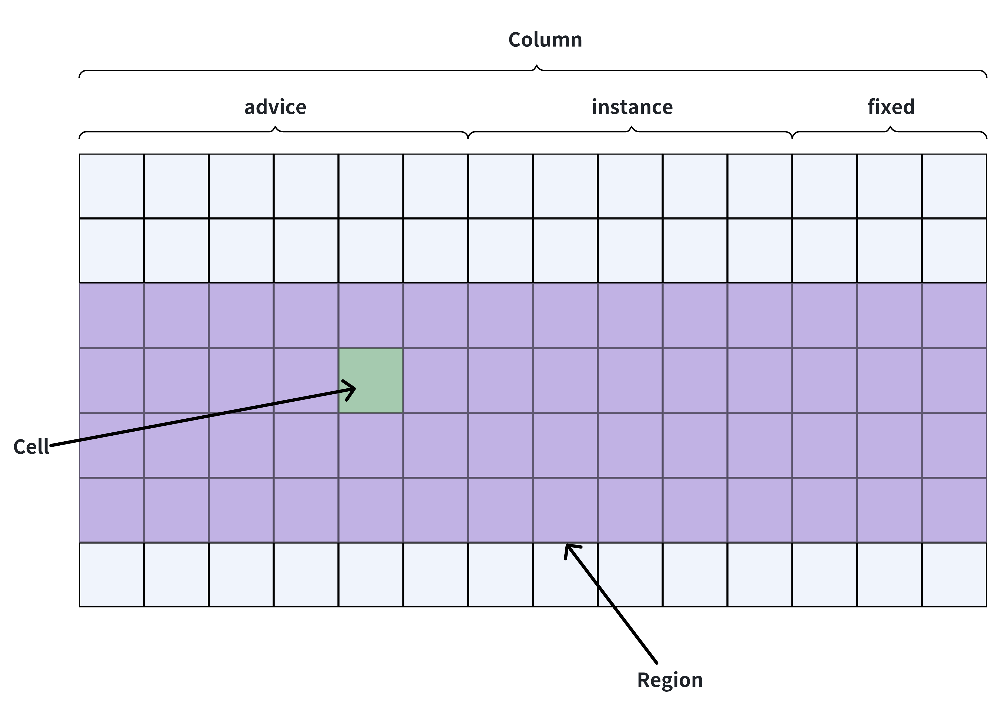
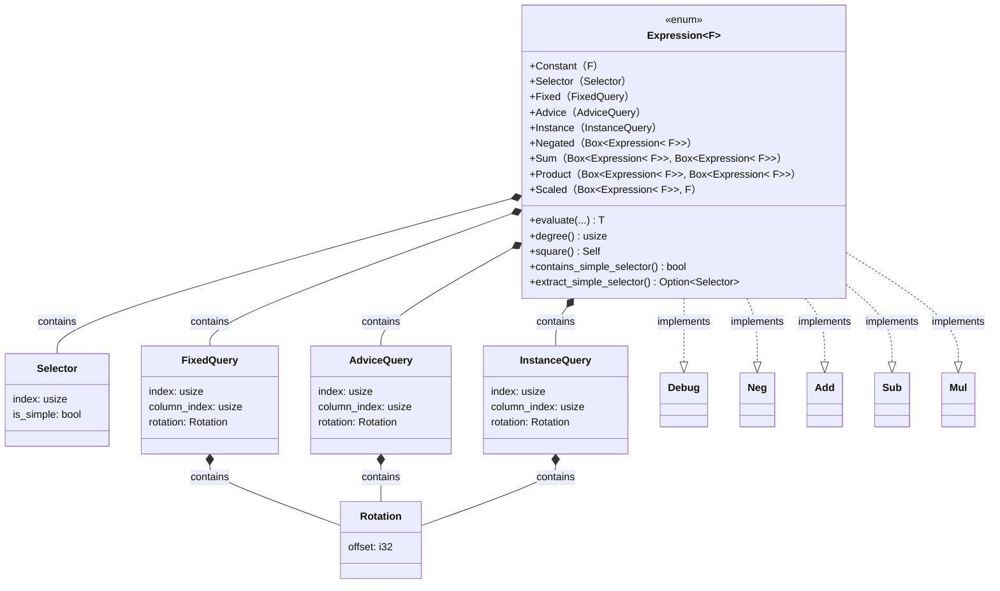
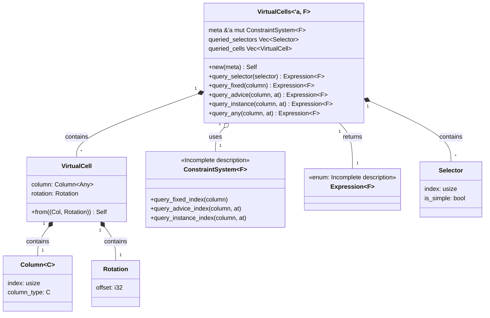
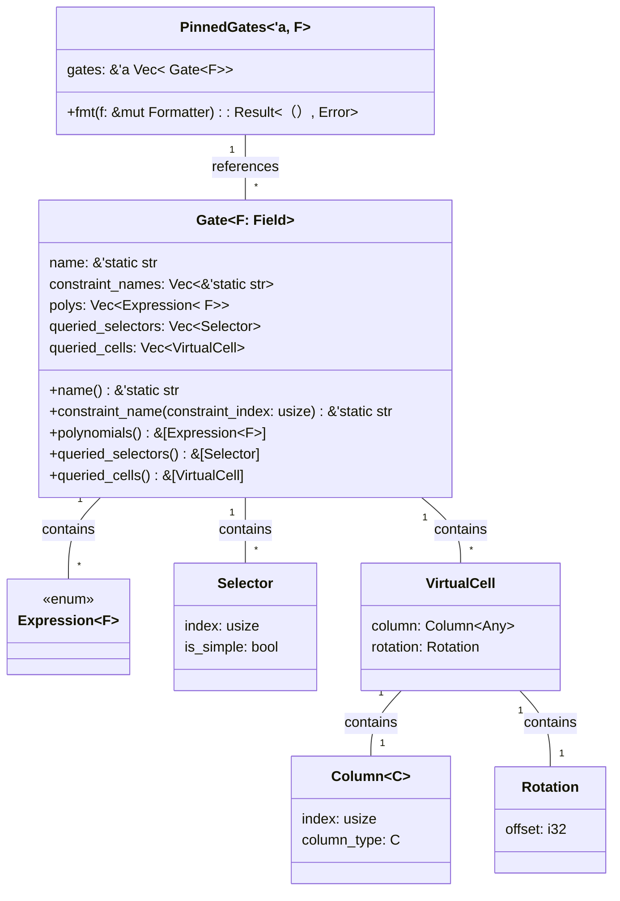
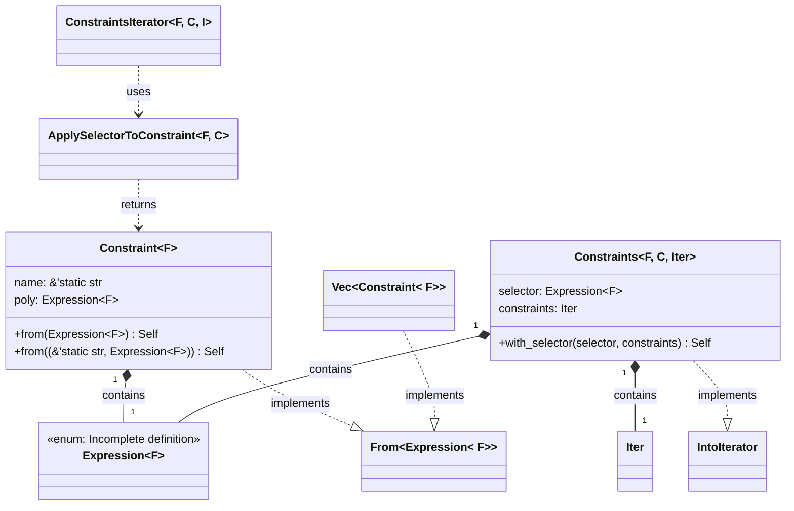
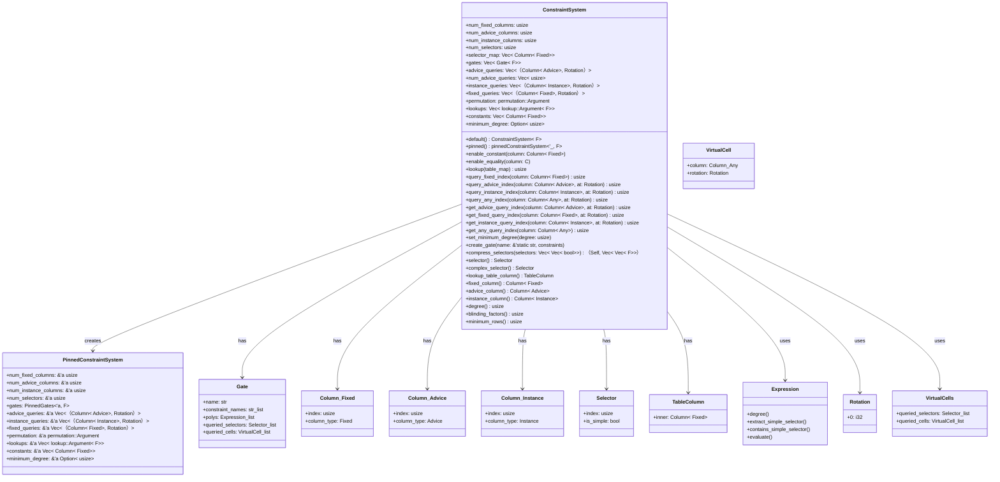
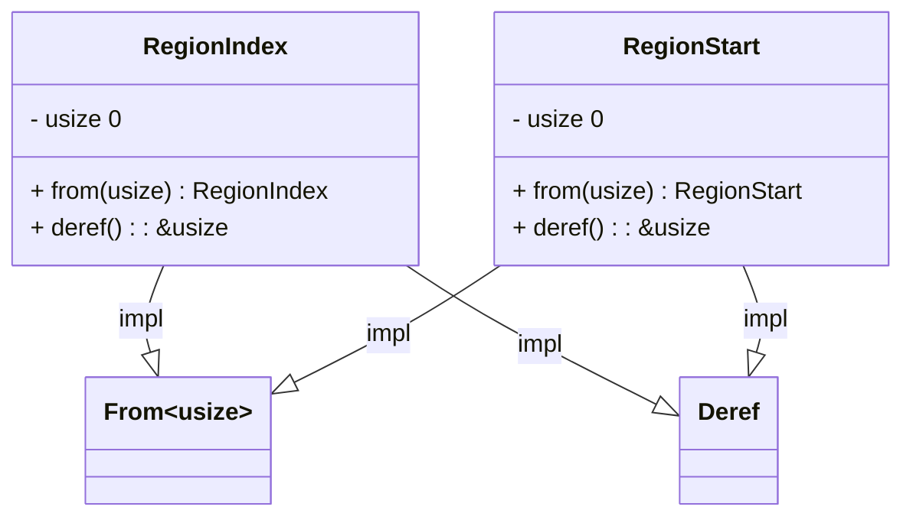
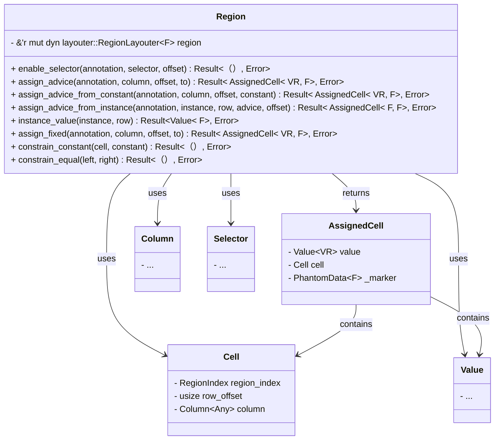
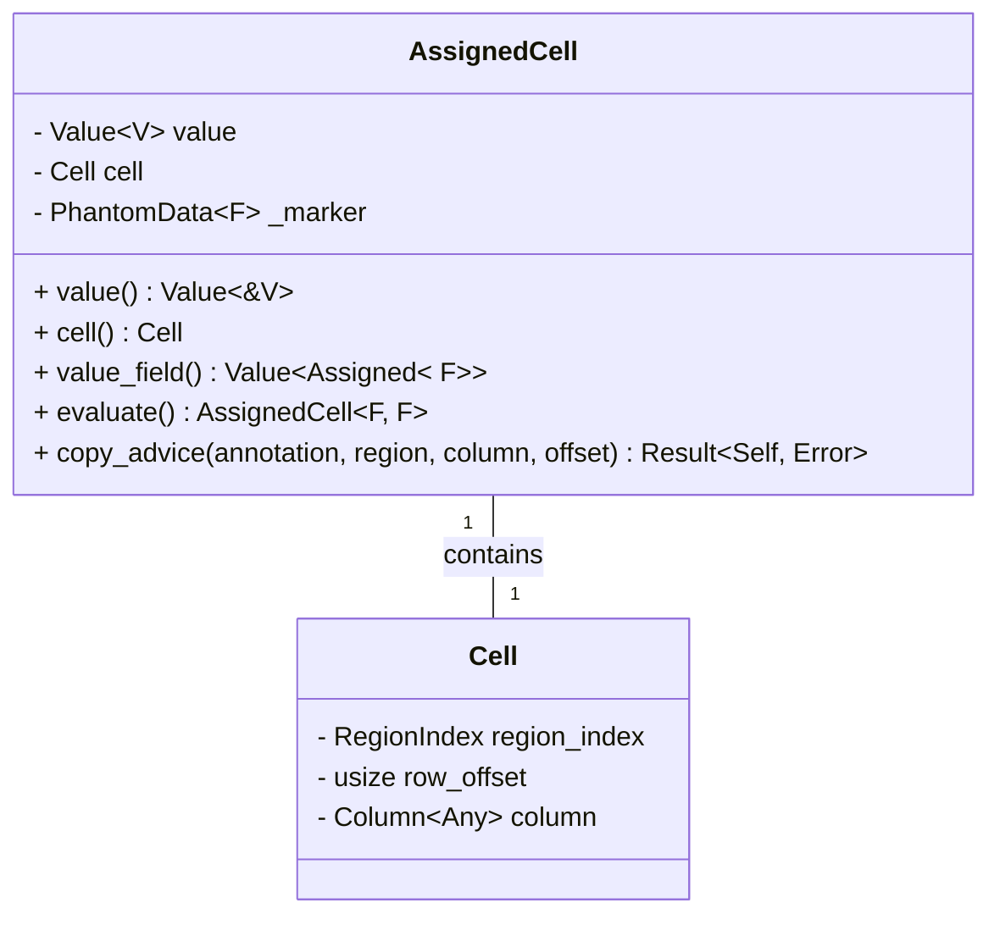

### Detailed Implementation of the Circuit Module


In Halo2, **columns** are fundamental structures that organize data in a circuit. There are three main types: **advice columns** (for private witness data provided by the prover), **instance columns** (for public inputs known to both the prover and verifier), and **fixed columns** (for precomputed constants or values set during circuit setup). A **cell** refers to a specific location within a column at a given row, identified by a column and a **rotation** (row offset). Cells are queried using `VirtualCells` to build constraints. A **region** is a contiguous block of rows where gates and constraints are applied. Columns and their cells are grouped into regions to define computational steps, with **selectors** enabling conditional enforcement of constraints within these regions. Together, these components form the backbone of circuit layout and constraint definition in Halo2.
#### 1. Core Types and Traits Definition
- **Column Types**: In `src/plonk/circuit.rs`, several column types are defined. `ColumnType` is a trait that represents a column type. There are three concrete column types: `Advice`, `Fixed`, and `Instance`, along with an enum `Any` that can represent any of these three types.
    ```rust
    pub trait ColumnType:
        'static + Sized + Copy + std::fmt::Debug + PartialEq + Eq + Into<Any>
    {
    }

    pub struct Advice;
    pub struct Fixed;
    pub struct Instance;

    pub enum Any {
        Advice,
        Fixed,
        Instance,
    }
    ```
    These types are used to distinguish different kinds of columns in the circuit, such as advice columns for witness values, fixed columns for pre - determined values, and instance columns for public inputs.

- **Column Structure**: The `Column` struct holds an index and a column type. It implements `Ord` and `PartialOrd` traits to ensure a deterministic ordering of columns, which is crucial for the consensus in the proving system.
    ```rust
    /// A column with an index and type
    pub struct Column<C: ColumnType> {
        index: usize,
        column_type: C,
    }
    ```

    ```mermaid
    classDiagram
        class ColumnType {
            <<trait>>
        }
        class Column {
            - index: usize
            - column_type: C
            + new(index: usize, column_type: C) Column< C>
            + index() usize
            + column_type() &C
            + cmp(other: &Column< C>) std::cmp::Ordering
            + partial_cmp(other: &Column< C>) Option< std::cmp::Ordering>
        }
        ColumnType <|.. Column : implements
    ```
    - **Attributes**:
        - `index: usize`: Represents the index of the column.
        - `column_type: C`: Represents the type of the column, where `C` is a type that implements the `ColumnType` trait.

    - **Methods**:
        - `new(index: usize, column_type: C) -> Column<C>`: A constructor method (only available in test configurations) that creates a new `Column` instance with the given index and column type.
        - `index() -> usize`: Returns the index of the column.
        - `column_type() -> &C`: Returns a reference to the column type.
        - `cmp(other: &Column<C>) -> std::cmp::Ordering`: Implements the `Ord` trait, which is used to compare two `Column` instances. The comparison first compares the column types, and if they are equal, it compares the indices.
        - `partial_cmp(other: &Column<C>) -> Option<std::cmp::Ordering>`: Implements the `PartialOrd` trait, which provides a partial comparison of two `Column` instances. It simply calls the `cmp` method.

- **Flowchart**:
    ```mermaid
    classDiagram
        %% Enum and marker types
        class Any {
            <<enum>>
            +Advice
            +Fixed
            +Instance
        }
        class Advice
        class Fixed
        class Instance

        %% Trait
        class ColumnType {
            <<trait>>
        }

        %% Trait implementations
        Advice ..|> ColumnType : Impl
        Fixed ..|> ColumnType : Impl
        Instance ..|> ColumnType : Impl
        Any ..|> ColumnType : Impl

        %% From conversions (type to enum)
        Advice ..> Any : From
        Fixed ..> Any : From
        Instance ..> Any : From

        %% Ordering
        Any ..|> Ord : Impl
        Any ..|> PartialOrd : Impl
    ```
    * `Advice`, `Fixed`, `Instance`, and `Any` all implement the `ColumnType` trait, which is used as a marker for valid column types.
    * This allows these types to be used wherever a generic parameter is required to implement ColumnType.
    * `Any` is an enum with three variants:     `Advice`, `Fixed`, and `Instance`. It is used to represent any column type generically.
    * `Advice`, `Fixed`, and `Instance` can be converted into `Any` using the From trait.
    * The `Any` enum implements `Ord` and `PartialOrd`, allowing columns to be sorted deterministically (with the order: `Instance` < `Advice` < `Fixed`). This is important for circuit layout determinism.

    ```mermaid
    classDiagram

        class Column_Advice
        class Column_Fixed
        class Column_Instance
        class Column_Any
        
        %% From conversions (Column<T> to Column<Any>)
        Column_Advice --|> Column_Any : From
        Column_Fixed --|> Column_Any : From
        Column_Instance --|> Column_Any : From

        %% TryFrom conversions (Column<Any> to Column<T>)
        Column_Any ..> Column_Advice : TryFrom
        Column_Any ..> Column_Fixed : TryFrom
        Column_Any ..> Column_Instance : TryFrom
    ```
    * `Column` is a generic struct parameterized by a `ColumnType` C (which can be Advice, Fixed, Instance, or Any).
    * There are conversions from `Column<Advice>`, `Column<Fixed>`, and `Column<Instance>` to `Column<Any>` via the `From` trait.
    * Conversely, you can attempt to convert a `Column<Any>` back to a specific column type using the `TryFrom` trait, which will fail if the type does not match.
    * ps: `Column_Fixed` means `Column<Fixed>`

#### 2. Selectors
- **Selector Definition**: A `Selector` represents a fixed boolean value per row of the circuit. It can be used to conditionally enable (portions of) gates. Selectors are disabled by default and need to be explicitly enabled on each row when required.
    ```rust
    #[derive(Clone, Copy, Debug, PartialEq, Eq, Hash)]
    pub struct Selector(pub(crate) usize, bool);

    impl Selector {
        /// Enable this selector at the given offset within the given region.
        pub fn enable<F: Field>(&self, region: &mut Region<F>, offset: usize) -> Result<(), Error> {
            region.enable_selector(|| "", self, offset)
        }

        /// Is this selector "simple"? Simple selectors can only be multiplied
        /// by expressions that contain no other simple selectors.
        pub fn is_simple(&self) -> bool {
            self.1
        }
    }
    ```
    * Example Usage:
        * Assume we have a circuit with two advice columns `A` and `B`, and a selector `S`. We'll represent rows in the circuit horizontally and columns vertically.

            ```plaintext
            Row |  A  |  B  |  S  | Constraint
            ----------------------------------
            0  |  1  |  -  |  0  | Not enforced
            1  |  -  |  1  |  1  | Enforced
            ```
        - The `A` and `B` columns represent advice columns where values can be assigned.
        - The `S` column represents the selector. A value of `0` means the selector is disabled, and a value of `1` means it is enabled.
        - The `Constraint` column indicates whether the constraint `A == B` is enforced on that row.
    * Summary: 
        * The `Selector` is a powerful tool in circuit design that allows for conditional enforcement of constraints. 
        * By enabling or disabling the selector on specific rows, we can control which parts of the circuit are active and which constraints are enforced.

#### 3. Query Structures
- **Query Types**: There are three query types defined: `FixedQuery`, `AdviceQuery`, and `InstanceQuery`. These are used to query values from fixed, advice, and instance columns at a certain relative location.
* **Role**: They allow the circuit designer to precisely define how values from different types of columns (fixed, advice, and instance) are accessed and used in the constraints of the circuit. By specifying the query index, column index, and rotation, the circuit can perform complex computations and verifications based on the values stored in these columns.
    ```rust
    /// Query of fixed column at a certain relative location
    #[derive(Copy, Clone, Debug)]
    pub struct FixedQuery {
        /// Query index
        pub(crate) index: usize,
        /// Column index
        pub(crate) column_index: usize,
        /// Rotation of this query, specifies the relative row (e.g., current, previous, next).
        pub(crate) rotation: Rotation,
    }

    /// Query of advice column at a certain relative location
    #[derive(Copy, Clone, Debug)]
    pub struct AdviceQuery {
        /// Query index
        pub(crate) index: usize,
        /// Column index
        pub(crate) column_index: usize,
        /// Rotation of this query, specifies the relative row (e.g., current, previous, next).
        pub(crate) rotation: Rotation,
    }

    /// Query of instance column at a certain relative location
    #[derive(Copy, Clone, Debug)]
    pub struct InstanceQuery {
        /// Query index
        pub(crate) index: usize,
        /// Column index
        pub(crate) column_index: usize,
        /// Rotation of this query, specifies the relative row (e.g., current, previous, next).
        pub(crate) rotation: Rotation,
    }

    ```
    * Role:
        * `FixedQuery`: used to represent a query of a fixed column at a certain relative location within the circuit.  
            * Fixed columns in a circuit typically contain values that are known and fixed throughout the proving process. For example, these could be constants or pre - computed values.
        * `AdviceQuery`: designed to query an advice column at a specific relative location. 
            * Advice columns are used to hold witness values, which are private inputs to the circuit. These values are typically unknown to the verifier but are used by the prover to construct a valid proof.
        * `InstanceQuery`: used to query an instance column at a particular relative location. 
            * Instance columns hold public inputs to the circuit, which are known to both the prover and the verifier. These values are used to verify the correctness of the proof.

#### 4. Lookup Table Column
- **TableColumn**: The `TableColumn` struct represents a fixed column of a lookup table. Lookup tables are an important component in zero - knowledge proof systems as they allow for efficient verification of membership and equality relationships within a set of pre - defined values.
* The `inner` field is of type `Column<Fixed>`, which means it represents a fixed column in the circuit. Fixed columns are used to store values that are known and fixed throughout the proving process. 
* `enable_equality`: This method enables equality on the `TableColumn`. By calling this method, the circuit designer can enforce that values in the table column satisfy certain equality constraints. This is crucial for ensuring the correctness and security of the lookup operations performed on the table column.
* Lookup table columns are always "encumbered" by the lookup arguments they are used in. This means that they cannot simultaneously be used as general fixed columns. Once a fixed column is designated as a `TableColumn` and used in a lookup argument, it is reserved for that specific lookup operation and cannot be used for other general fixed - value assignments.
    ```rust
    #[derive(Clone, Copy, Debug, Eq, PartialEq, Hash, Ord, PartialOrd)]
    pub struct TableColumn {
        /// The fixed column that this table column is stored in.
        ///
        /// # Security
        ///
        /// This inner column MUST NOT be exposed in the public API, or else chip developers
        /// can load lookup tables into their circuits without default-value-filling the
        /// columns, which can cause soundness bugs.
        inner: Column<Fixed>,
    }

    impl TableColumn {
        /// It is marked as `pub(crate)` to restrict its access to the crate level.
        pub(crate) fn inner(&self) -> Column<Fixed> {
            self.inner
        }

        /// Enable equality on this TableColumn.
        pub fn enable_equality<F: Field>(&self, meta: &mut ConstraintSystem<F>) {
            meta.enable_equality(self.inner)
        }
    }
    ```
* A lookup table can be loaded into a `TableColumn` via the `Layouter::assign_table` method. This method allows the circuit designer to populate the table column with the necessary values. 
* Currently, a single `TableColumn` can only contain one lookup table. However, these columns can be used in multiple lookup arguments through the `ConstraintSystem::lookup` method. This flexibility enables the circuit designer to reuse the same table column in different parts of the circuit for different verification purposes.
    * Example: Let's assume we are working on a circuit that verifies some arithmetic operations. We have a lookup table that stores pre - computed squares of numbers from 0 to 9. We can use this table in different parts of the circuit to check if a certain value is a square of a number within this range.
        ```rust
        use halo2_proofs::{
            circuit::{Layouter, SimpleFloorPlanner},
            pasta::Fp,
            plonk::{Circuit, ConstraintSystem, TableColumn},
            poly::Rotation,
        };

        #[derive(Clone)]
        struct MyCircuitConfig {
            table: TableColumn,
            advice: Column<Advice>,
        }

        struct MyCircuit;

        impl Circuit<Fp> for MyCircuit {
            type Config = MyCircuitConfig;
            type FloorPlanner = SimpleFloorPlanner;

            fn without_witnesses(&self) -> Self {
                Self
            }

            fn configure(meta: &mut ConstraintSystem<Fp>) -> Self::Config {
                let advice = meta.advice_column();
                let table = meta.lookup_table_column();

                // First lookup argument
                meta.lookup(|meta| {
                    let a = meta.query_advice(advice, Rotation::cur());
                    vec![(a, table)]
                });

                // Second lookup argument
                meta.lookup(|meta| {
                    let b = meta.query_advice(advice, Rotation::prev());
                    vec![(b, table)]
                });

                Self::Config {
                    table,
                    advice: advice.index(),
                }
            }

            fn synthesize(
                &self,
                config: Self::Config,
                mut layouter: impl Layouter<Fp>,
            ) -> Result<(), halo2_proofs::plonk::Error> {
                layouter.assign_table(
                    || "Square lookup table",
                    |mut table| {
                        for i in 0..10 {
                            let square = Fp::from(i * i);
                            table.assign_cell(
                                || format!("Square of {}", i),
                                config.table,
                                i,
                                || halo2_proofs::circuit::Value::known(square),
                            )?;
                        }
                        Ok(())
                    },
                )?;

                layouter.assign_region(
                    || "Region with lookup checks",
                    |mut region| {
                        // Assign a value that is a square
                        region.assign_advice(
                            || "Advice value (square)",
                            config.advice,
                            0,
                            || halo2_proofs::circuit::Value::known(Fp::from(4)),
                        )?;

                        // Assign another value that is a square
                        region.assign_advice(
                            || "Advice value (square)",
                            config.advice,
                            1,
                            || halo2_proofs::circuit::Value::known(Fp::from(9)),
                        )?;

                        Ok(())
                    },
                )?;

                Ok(())
            }
        }
        ```
    * Explanation:
        * Single Table in `TableColumn`: In the `synthesize` method, we assign a single lookup table to the `TableColumn` (`config.table`). This table stores the squares of numbers from 0 to 9.
        * Multiple Lookup Arguments: In the `configure` method, we define two lookup arguments using the same `TableColumn`. The first lookup argument checks the current value in the advice column against the table, and the second lookup argument checks the previous value in the advice column against the table.

    * This shows that although a `TableColumn` can hold only one lookup table, it can be used in multiple lookup arguments to perform different checks in the circuit. 

#### 5. Circuit Assignment
- **Assignment Trait**: The `Assignment` trait enables a `Circuit` to direct a backend to assign witnesses for a constraint system. It provides a set of methods for managing `regions` and `namespaces`, operating on various columns (`instance`, `advice`, and `fixed` columns), and handling constraints.   
    * Through these methods, Assignment allows the Circuit to precisely guide the backend in performing witness assignment for the constraint system, which is an essential part of building and verifying circuits. For example:
        * in `src/plonk/prover.rs`, some methods of `Assignment` are implemented to synthesize the circuit and obtain witness information.
        * in `src/dev/graph.rs`, `Assignment` is implemented to construct the dot graph of the circuit.

    ```mermaid
    classDiagram
        class Assignment {
            +enter_region(name_fn: N)
            +exit_region()
            +enable_selector(annotation: A, selector: &Selector, row: usize) Result<（）, Error>
            +query_instance(column: Column< Instance>, row: usize) Result< Value< F>, Error>
            +assign_advice(annotation: A, column: Column< Advice>, row: usize, to: V) Result<（）, Error>
            +assign_fixed(annotation: A, column: Column< Fixed>, row: usize, to: V) Result<（）, Error>
            +copy(left_column: Column< Any>, left_row: usize, right_column: Column< Any>, right_row: usize) Result<（）, Error>
            +fill_from_row(column: Column< Fixed>, row: usize, to: Value< Assigned< F>>) Result<（）, Error>
            +push_namespace(name_fn: N)
            +pop_namespace(gadget_name: Option< String>)
        }

        class Column {
            +index: usize
            +column_type: C
        }

        class Selector {
            +0: usize
            +1: bool
        }

        class Value {
            +inner: Option< Assigned< F>>
        }

        class Assigned {
            <<enum>>
            +Zero
            +Trivial
            +Rational
            // TODO(sure2web3) perfect the details
        }

        class Error {
            +message: String
        }

        Assignment --> Column : Uses
        Assignment --> Selector : Uses
        Assignment --> Value : Uses
        Assignment --> Assigned : Uses
        Assignment --> Error : Returns
    ```
    
    | Method Name | Description | Parameters | Return Type | Role in Halo2 |
    | --- | --- | --- | --- | --- |
    | `enter_region` | Creates a new region and enters into it.  Used for organizing assignments into logical regions. Panics if currently in a region (if `exit_region` was not called). Not intended for downstream consumption; use [`Layouter::assign_region`] instead. | `name_fn: N` where `NR: Into<String>` and `N: FnOnce() -> NR`, name_fn is a closure that returns a name for the region. | `()` | In Halo2, regions are used to organize the layout of a circuit. This method is crucial for starting a new logical section within the circuit layout process, allowing for modular and structured circuit design. |
    | `exit_region` | Exits the current region. Panics if not currently in a region (if `enter_region` was not called). Not intended for downstream consumption; use [`Layouter::assign_region`] instead. | None | `()` | Marks the end of a logical section in the circuit layout. It ensures proper scoping and organization of the circuit regions, which is important for the correct synthesis and evaluation of the circuit. |
    | `enable_selector` | Enables a selector at the given row. | `annotation: A`, `selector: &Selector`, `row: usize` where `A: FnOnce() -> AR` and `AR: Into<String>` | `Result<(), Error>` | Selectors are used to conditionally enable parts of gates in the circuit. Enabling a selector at a specific row allows the circuit to activate certain constraints only when needed, providing flexibility in circuit design. |
    | `query_instance` | Queries the cell of an instance column at a particular absolute row. Returns the cell's value, if known. | `column: Column<Instance>`, `row: usize` | `Result<Value<F>, Error>` | Instance columns hold public input values. Querying these columns allows the circuit to access and use the public data during the proof generation and verification process, which is essential for zero - knowledge proofs. |
    | `assign_advice` | Assigns an advice column value (witness). | `annotation: A`, `column: Column<Advice>`, `row: usize`, `to: V` where `V: FnOnce() -> Value<VR>`, `VR: Into<Assigned<F>>`, `A: FnOnce() -> AR`, and `AR: Into<String>`, to is a closure that provides the value. | `Result<(), Error>` | Advice columns are used to store witness values, which are the private inputs in a zero - knowledge proof. Assigning values to these columns is a fundamental step in constructing the proof. |
    | `assign_fixed` | Assigns a value to a fixed column at a specific row. | `annotation: A`, `column: Column<Fixed>`, `row: usize`, `to: V` where `V: FnOnce() -> Value<VR>`, `VR: Into<Assigned<F>>`, `A: FnOnce() -> AR`, and `AR: Into<String>` | `Result<(), Error>` | Fixed columns have pre - determined values throughout the circuit. Assigning fixed values is important for setting up the constant parts of the circuit, such as coefficients in polynomial equations. |
    | `copy` | Assigns two cells to have the same value. | `left_column: Column<Any>`, `left_row: usize`, `right_column: Column<Any>`, `right_row: usize` | `Result<(), Error>` | This method is used to enforce equality between two cells in the circuit. It helps in creating relationships between different parts of the circuit, which is necessary for expressing complex constraints. |
    | `fill_from_row` | Fills a fixed `column` starting from the given `row` with value `to`. | `column: Column<Fixed>`, `row: usize`, `to: Value<Assigned<F>>` | `Result<(), Error>` | Useful for initializing or populating fixed columns with a specific value from a certain row onwards. This can simplify the process of setting up the constant parts of the circuit. |
    | `push_namespace` | Creates a new (sub)namespace and enters into it for organizing assignments. Not intended for downstream consumption; use [`Layouter::namespace`] instead. | `name_fn: N` where `NR: Into<String>` and `N: FnOnce() -> NR` | `()` | Namespaces are used to organize and isolate different parts of the circuit. Pushing a new namespace allows for better modularity and separation of concerns in the circuit design. |
    | `pop_namespace` | Exits out of the existing namespace. Not intended for downstream consumption; use [`Layouter::namespace`] instead. | `gadget_name: Option<String>` | `()` | Marks the end of a namespace, ensuring proper scoping and organization of the circuit components within namespaces. It helps in maintaining a clean and structured circuit layout. |

#### 6. FloorPlanner 
- **FloorPlanner Trait**: The `FloorPlanner` trait defines a floor planning strategy for a circuit. It is chip - agnostic and applies its strategy to the circuit it is used within. The main function of this trait is the `synthesize` method, which takes a constraint system (`CS`), a circuit (`C`), a configuration object (`config`), and a list of fixed columns (`constants`). 
* `synthesize` refers to the process of constructing a circuit by assigning values to the various components of the circuit and enforcing the necessary constraints. This process is crucial for creating zero - knowledge proofs, as it allows the prover to demonstrate knowledge of a solution to a given problem without revealing the actual solution.
    ```rust 
    pub trait FloorPlanner {
        /// Given the provided `cs`, synthesize the given circuit.
        ///
        /// `constants` is the list of fixed columns that the layouter may use to assign
        /// global constant values. These columns will all have been equality-enabled.
        fn synthesize<F: Field, CS: Assignment<F>, C: Circuit<F>>(
            /*
                cs: &mut CS: A mutable reference to an assignment backend (the constraint system).
                circuit: &C: A reference to the circuit to be synthesized.
                config: C::Config: The configuration object for the circuit.
                constants: Vec<Column<Fixed>>: A vector of fixed columns used for global constants.
            */
            cs: &mut CS,
            circuit: &C,
            config: C::Config,
            constants: Vec<Column<Fixed>>,
        ) -> Result<(), Error>;
    }
    ```
    * Internally, the `synthesize` method performs the following steps:
        - Instantiates a `Layouter` for the floor planner.
        - Performs any necessary setup or measurement tasks, which might involve one or more calls to `Circuit::default().synthesize(config, &mut layouter)`.
        - Calls `circuit.synthesize(config, &mut layouter)` exactly once.

* In Halo2, the `FloorPlanner` is responsible for determining how the circuit components are arranged in the circuit layout. It helps in optimizing the use of resources such as columns and rows in the circuit, and it orchestrates the `synthesis` process of the circuit. Different implementations of the `FloorPlanner` can lead to different circuit layouts, which can affect the performance and efficiency of the circuit.

#### 7. Expression

- **Expression** : a fundamental component in Halo2's constraint system, representing low-degree polynomial expressions that define the relationships between circuit elements. `Expression` plays a central role in translating high-level circuit specifications into the low-level polynomial constraints required for efficient and secure zero-knowledge proofs.
    * This enum defines all the possible forms a low-degree polynomial expression can take in the circuit system, including constants, column queries, and arithmetic operations.
    ```rust
    /// Low-degree expression representing an identity that must hold over the committed columns.
    #[derive(Clone)]
    pub enum Expression<F> {
        /// This is a constant polynomial
        Constant(F),
        /// This is a virtual selector
        Selector(Selector),
        /// This is a fixed column queried at a certain relative location
        Fixed(FixedQuery),
        /// This is an advice (witness) column queried at a certain relative location
        Advice(AdviceQuery),
        /// This is an instance (external) column queried at a certain relative location
        Instance(InstanceQuery),
        /// This is a negated polynomial
        /// The use of Box allows for recursive expressions (expressions containing other expressions). 
        Negated(Box<Expression<F>>),
        /// This is the sum of two polynomials
        Sum(Box<Expression<F>>, Box<Expression<F>>),
        /// This is the product of two polynomials
        Product(Box<Expression<F>>, Box<Expression<F>>),
        /// This is a scaled polynomial
        /// Represents an expression scaled (multiplied) by a constant value of type F.
        Scaled(Box<Expression<F>>, F),
    }
    ```
- **Function**:
    | Function | Description | Principle in Halo2 |
    | --- | --- | --- |
    | `evaluate(...)` | This method recursively evaluates an `Expression<F>` by applying the provided closures (function arguments) to each variant of the enum. It is generic over the return type T, so you can use it to evaluate to any type you want (for example, a field element, a symbolic expression, or a string).<br><br>  For composite expressions (like sum, product, negated, scaled), the function recursively evaluates sub-expressions and then applies the corresponding operation closure. | This function is a visitor for the Expression<F> enum. It walks the expression tree and applies the provided closures to each node, allowing you to define custom logic for each kind of expression and operation. It is a powerful pattern for symbolic computation, interpretation, or code generation. |
    | `degree()` | Computes the degree of the polynomial expression.<br><br> Constant:0<br> Selector:1<br> Fixed:1<br> Advice:1<br> Instance:1<br> Negated(poly):poly.degree()<br> Sum(a, b):max(a.degree(), b.degree())<br> Product(a, b):a.degree() + b.degree()<br> Scaled(poly, _):poly.degree() | The degree is crucial for determining the size of the polynomial domain and ensuring the circuit's constraints fit within the allowed computational limits. |
    | `square()` | Returns the square of the expression. | Convenience method for common polynomial operations, simplifying circuit design. |
    | `contains_simple_selector()` | Checks whether or not this expression contains a simple `Selector`.<br><br> This function uses `evaluate` to recursively walk the expression tree and returns true if any part of the expression contains a simple selector, by checking each selector node with selector.is_simple(). | Simple selectors have restrictions on their use in expressions to maintain circuit efficiency and correctness. |
    | `extract_simple_selector()` | This function recursively traverses the expression tree using the `evaluate` method to find and extract a simple selector, if present.<br><br> For each selector node, it checks if the selector is simple—if so, it returns `Some(selector)`, otherwise `None`. For `sum` and `product` nodes, it uses a custom operator (op) that returns the found `selector` if only one is present, but panics if two simple selectors are found in the same expression (which is not allowed). If no simple selector is found, it returns `None`. | Used during circuit optimization to handle simple selectors separately from other expression components. |
    | `fmt(...)` | Formats the expression for debugging purposes. | Helps developers inspect and debug expressions during circuit development. |
    | `neg()` | Implements the negation operator for expressions.<br><br> -expr becomes Expression::Negated(Box::new(expr)). | Allows the creation of negative polynomial terms. |
    | `add(rhs)` | Implements the addition operator for expressions.<br><br> If either side contains a simple selector, it panics. Otherwise, returns Expression::Sum(Box::new(self), Box::new(rhs)). | Creates a new expression representing the sum of two polynomials, ensuring no simple selectors are used in the operation. |
    | `sub(rhs)` | Implements the subtraction operator for expressions.<br><br> Panics if either side contains a simple selector. Otherwise, returns the sum of self and the negation of rhs (Expression::Sum(Box::new(self), Box::new(-rhs))). | Creates a new expression representing the difference of two polynomials, ensuring no simple selectors are used in the operation. |
    | `mul(rhs)` | Implements the multiplication operator for expressions.<br><br> Panics if both sides contain a simple selector. Otherwise, returns Expression::Product(Box::new(self), Box::new(rhs)). | Creates a new expression representing the product of two polynomials, preventing the multiplication of two expressions containing simple selectors. |
    | `mul(rhs: F)` | Implements scalar multiplication for expressions.<br><br> Implements the Mul trait for multiplying an expression by a constant of type F. Returns Expression::Scaled(Box::new(self), rhs). | Scales the polynomial by a constant field element, simplifying coefficient adjustments in constraints. |    

#### 7. VirtualCell and VirtualCells

- **VirtualCell**: a PLONK cell that has been queried at a particular relative offset (column and rotation) within a custom gate. It also provides a convenient way to create a `VirtualCell` from any column type and a rotation using the `From` trait.
- **VirtualCells**: The `VirtualCells` struct is a utility for querying "virtual cells" when defining custom gates or lookup tables in a Halo2 circuit. 
    * a collection of `VirtualCell` instances that can be queried within a gate. It provides methods to query selectors, fixed columns, advice columns, and instance columns at specific rotations.
    ```rust
    /// Exposes the "virtual cells" that can be queried while creating a custom gate or lookup table.
    #[derive(Debug)]
    pub struct VirtualCells<'a, F: Field> {
        meta: &'a mut ConstraintSystem<F>,
        /// Keeps track of all selectors queried during gate construction.
        queried_selectors: Vec<Selector>,
        /// Keeps track of all cells (columns and rotations) queried.
        queried_cells: Vec<VirtualCell>,
    }
    ``` 

* **Functions**:
    | Function | Description | Principle in Halo2 |
    | --- | --- | --- |
    | `VirtualCell::from((Col, Rotation))` | Creates a `VirtualCell` from a column and rotation. | Encapsulates a column and rotation into a single queryable cell for use in gates. |
    | `VirtualCells::new(meta)` | Initializes a new `VirtualCells` instance with a reference to `ConstraintSystem`. | Sets up the context for querying cells and selectors within a gate. |
    | `query_selector(selector)` | Queries a selector at the current position and records it. | Selectors enable conditional enforcement of gates, critical for circuit flexibility. |
    | `query_fixed(column)` | Queries a fixed column at the current rotation and records the cell. | Fixed columns store constants or precomputed values, queried for constraint evaluation. |
    | `query_advice(column, at)` | Queries an advice column at a specified rotation and records the cell. | Advice columns hold private witness data, queried to enforce constraints on prover-provided values. |
    | `query_instance(column, at)` | Queries an instance column at a specified rotation and records the cell. | Instance columns store public inputs, queried to ensure consistency with verifier's expectations. |
    | `query_any(column, at)` | Queries a column of any type (advice, fixed, instance) with rotation checks. | Provides a generic interface for querying columns, ensuring fixed columns are only queried at the current rotation.<br><br> **Reason**<br><br> **Fixed columns are not witness-dependent**: Their values are known and fixed for all rows, so there is no meaningful concept of "previous" or "next" for a fixed column.<br> **Implementation constraint**: Allowing rotations on fixed columns would complicate the constraint system and could lead to ambiguity or errors, since the value at any rotation is always the same as the value at the current row.<br> **Safety**: By restricting queries to only the current row (Rotation::cur()), the API prevents accidental misuse or logical errors in circuit design.<br><br> You can only query a fixed column at the current row because its value does not change across rows, and allowing other rotations would not make sense and could introduce bugs or confusion in the circuit logic. That’s why the code panics if you try to query a fixed column at any rotation other than the current one. |

* **Role in Halo2**:
    | Role | Description |
    | --- | --- |
    | Abstraction for Querying | `VirtualCell` represents a cell (column + rotation) queried within a gate.<br><br> `VirtualCells` provides methods to query columns and selectors, building up the list of dependencies for a gate. |
    | Constraint Definition | By querying columns and selectors, circuits define polynomial constraints that must hold true.<br><br> These constraints are critical for proving that the circuit's computations are correct without revealing private inputs. |
    | Circuit Flexibility | Rotations allow querying columns in different rows, enabling temporal relationships (e.g., state transitions).<br><br> Selectors enable conditional constraints, allowing parts of the circuit to be activated/deactivated based on computation needs. |
    | Integration with `ConstraintSystem` | `VirtualCells` interacts with `ConstraintSystem` to manage column indices and track dependencies, ensuring efficient constraint enforcement during proof generation. |


#### 7. Gate and PinnedGates

- **Gate**: Represents a logical gate in a circuit, which enforces constraints between different cells (columns and rows). Gates are fundamental building blocks in zero-knowledge proofs, ensuring that computed values adhere to specific relationships.
    ```rust
    #[derive(Clone, Debug)]
    pub(crate) struct Gate<F: Field> {
        /// The name of the gate
        name: &'static str,
        /// A vector of names for each constraint in the gate.
        constraint_names: Vec<&'static str>,
        /// A vector of polynomial expressions representing the constraints.
        polys: Vec<Expression<F>>,
        /// We track queried selectors separately from other cells, so that we can use them to
        /// trigger debug checks on gates.
        /// Selectors used in the gate
        queried_selectors: Vec<Selector>,
        /// Cells (columns and rotations) that are queried in this gate.
        queried_cells: Vec<VirtualCell>,
    }
    ```
- **PinnedGates**: PinnedGates serves as a lightweight, immutable wrapper around a collection of Gate instances within a `ConstraintSystem`. Its primary role is to provide a debug-friendly view of the gates' polynomial constraints while ensuring that the underlying data remains unchanged. By encapsulating references to the original gates (&'a Vec<Gate<F>>), PinnedGates avoids data duplication and maintains consistency with the constraint system's state.
    * The Debug implementation of `PinnedGates` formats the gate polynomials for logging and inspection, which is crucial for developers during circuit development and testing. This allows them to verify that the constraints defined in the gates (e.g., arithmetic relationships between columns) are correctly formulated. 
    * Additionally, `PinnedGates` is integrated into the `PinnedConstraintSystem`, which represents the minimal set of parameters needed to determine the constraint system's behavior. This integration ensures that developers can access and analyze the gate constraints without modifying the original constraint system, promoting safety and efficiency in the circuit design process.

    | Function | Description | Role in Halo2 |
    | --- | --- | --- |
    | `Gate::name()` | Returns the static string identifier for the gate. | Used for debugging and logging to identify gates in the circuit. |
    | `Gate::constraint_name(constraint_index: usize)` | Returns the name of a specific constraint within the gate. | Helps in debugging by providing human-readable names for individual constraints. |
    | `Gate::polynomials()` | Returns the polynomial expressions that define the gate's constraints. | Essential for verifying that the circuit adheres to the specified mathematical relationships during proof generation and verification. |
    | `Gate::queried_selectors()` | Returns the selectors used to enable or disable the gate in specific rows. | Selectors control when a gate's constraints are active, allowing conditional logic in the circuit. |
    | `Gate::queried_cells()` | Returns the cells (columns and rotations) involved in the gate's constraints. | Helps in understanding which parts of the circuit are affected by the gate's constraints. |
    | `PinnedGates::fmt()` | Formats the gate polynomials for debugging purposes. | Used by developers to inspect the polynomial expressions during circuit development and testing. |

#### 7. Constraint and Constraints

- **Constraint**: Represents a single constraint in a circuit, which is defined by a polynomial expression. `Constraints` are used to enforce relationships between different cells (columns and rows) in the circuit, ensuring that the computed values adhere to specific mathematical rules.
    ```rust
    /// An individual polynomial constraint.
    ///
    /// These are returned by the closures passed to `ConstraintSystem::create_gate`.
    #[derive(Debug)]
    pub struct Constraint<F: Field> {
        name: &'static str,
        poly: Expression<F>,
    }
    ```
- **Constraints**: A collection of constraints that can be applied to a circuit, typically used to group multiple constraints under a common selector expression. This allows for conditional enforcement of constraints based on the selector's activation.
    ```rust
    #[derive(Debug)]
    pub struct Constraints<F: Field, C: Into<Constraint<F>>, Iter: IntoIterator<Item = C>> {
        selector: Expression<F>,
        constraints: Iter,
    }
    ```

- **ConstraintsIterator**: An iterator type for `Constraints`, which applies the selector to each constraint during iteration. This allows for efficient processing of constraints in the circuit, ensuring that only active constraints are evaluated based on the selector(lazily applying the selector during iteration). 
    * It zips (pairs together) an infinite iterator that repeats the selector expression with another iterator I (which yields constraints).
    * Then it maps each pair (selector, constraint) using the apply_selector_to_constraint function, producing a Constraint<F> for each pair.
    ```rust
    type ApplySelectorToConstraint<F, C> = fn((Expression<F>, C)) -> Constraint<F>;
    type ConstraintsIterator<F, C, I> = std::iter::Map<
        std::iter::Zip<std::iter::Repeat<Expression<F>>, I>,
        ApplySelectorToConstraint<F, C>,
    >;
    ```

- **Functions**:

    | Function | Description | Principle in Halo2 |
    | --- | --- | --- |
    | `Constraint::from(Expression<F>)` | Converts an `Expression` into a `Constraint` with an empty name. | Simplifies constraint creation for unnamed expressions. |
    | `Constraint::from((&'static str, Expression<F>))` | Creates a named `Constraint` from an `Expression`. | Enhances debuggability by associating names with constraints. |
    | `Constraints::with_selector(selector, constraints)` | Constructs a `Constraints` instance with a selector and iterator of constraints.<br><br> Each constraint `c` in `constraints` (iterator) will be converted into the constraint `selector * c`, so the selector controls when the constraints are active. | Binds constraints to a selector, forming `selector * constraint` relationships. |
    | **`apply_selector_to_constraint`** | Applies a selector to a constraint, producing `selector * constraint.poly`. | Implements the core logic for combining selectors with constraints. |
    | **`IntoIterator for Constraints`** | Converts `Constraints` into an iterator of `Constraint` instances. | This implementation allows a Constraints object to be turned into an iterator that yields each constraint multiplied by the common selector.<br><br> This is useful for applying a selector to a whole set of constraints in a circuit, enabling or disabling them together. |

- **Example**:
    ```rust
    /// A set of polynomial constraints with a common selector.

    use group::ff::Field;
    use halo2_proofs::{pasta::Fp, plonk::{Constraints, Expression}, poly::Rotation};
    use halo2_proofs::plonk::ConstraintSystem;

    let mut meta = ConstraintSystem::<Fp>::default();
    /// Three advice columns (a, b, c) and one selector (s) are allocated.
    let a = meta.advice_column();
    let b = meta.advice_column();
    let c = meta.advice_column();
    let s = meta.selector();
    /// defines a new gate named "foo".
    meta.create_gate("foo", |meta| {
        /// Inside the closure, the circuit designer can query columns and selectors at specific rotations (row offsets).
        /// Queries the value of column a at the next row.
        let next = meta.query_advice(a, Rotation::next());
        let a = meta.query_advice(a, Rotation::cur());
        let b = meta.query_advice(b, Rotation::cur());
        let c = meta.query_advice(c, Rotation::cur());
        /// Queries the selector at the current row.
        let s_ternary = meta.query_selector(s);
        /// Defines an expression representing 1 - a
        let one_minus_a = Expression::Constant(Fp::ONE) - a.clone();
        /// creates a set of constraints that are only active when the selector is enabled.
        Constraints::with_selector(
            s_ternary,
            std::array::IntoIter::new([
                /// Ensures that a is either 0 or 1 by enforcing a * (1 - a) == 0.
                ("a is boolean", a.clone() * one_minus_a.clone()),
                /// Enforces that the value of a in the next row equals b if a is 1, or c if a is 0. This is written as next - (a * b + (1 - a) * c) == 0.
                ("next == a ? b : c", next - (a * b + one_minus_a * c)),
            ]),
        )
    });
    ```

#### 8. ConstraintSystem and PinnedConstraintSystem

- **ConstraintSystem struct**: The `ConstraintSystem` trait plays a central role in Halo2 by providing a framework for defining, managing, and optimizing the constraints of a circuit, ensuring the correct assignment of values and the enforcement of logical relationships within the circuit.
    ```rust
    /// This is a description of the circuit environment, such as the gate, column and
    /// permutation arrangements.
    #[derive(Debug, Clone)]
    pub struct ConstraintSystem<F: Field> {
        pub(crate) num_fixed_columns: usize,
        pub(crate) num_advice_columns: usize,
        pub(crate) num_instance_columns: usize,
        pub(crate) num_selectors: usize,

        /// This is a cached vector that maps virtual selectors to the concrete
        /// fixed column that they were compressed into. This is just used by dev
        /// tooling right now.
        pub(crate) selector_map: Vec<Column<Fixed>>,

        pub(crate) gates: Vec<Gate<F>>,
        pub(crate) advice_queries: Vec<(Column<Advice>, Rotation)>,
        // Contains an integer for each advice column
        // identifying how many distinct queries it has
        // so far; should be same length as num_advice_columns.
        num_advice_queries: Vec<usize>,
        pub(crate) instance_queries: Vec<(Column<Instance>, Rotation)>,
        pub(crate) fixed_queries: Vec<(Column<Fixed>, Rotation)>,

        // Permutation argument for performing equality constraints
        pub(crate) permutation: permutation::Argument,

        // Vector of lookup arguments, where each corresponds to a sequence of
        // input expressions and a sequence of table expressions involved in the lookup.
        pub(crate) lookups: Vec<lookup::Argument<F>>,

        // Vector of fixed columns, which can be used to store constant values
        // that are copied into advice columns.
        pub(crate) constants: Vec<Column<Fixed>>,

        pub(crate) minimum_degree: Option<usize>,
    }
    ```
- **PinnedConstraintSystem struct**: Represents the minimal parameters that determine a `ConstraintSystem`.
    ```rust
    #[allow(dead_code)]
    #[derive(Debug)]
    pub struct PinnedConstraintSystem<'a, F: Field> {
        num_fixed_columns: &'a usize,
        num_advice_columns: &'a usize,
        num_instance_columns: &'a usize,
        num_selectors: &'a usize,
        gates: PinnedGates<'a, F>,
        advice_queries: &'a Vec<(Column<Advice>, Rotation)>,
        instance_queries: &'a Vec<(Column<Instance>, Rotation)>,
        fixed_queries: &'a Vec<(Column<Fixed>, Rotation)>,
        permutation: &'a permutation::Argument,
        lookups: &'a Vec<lookup::Argument<F>>,
        constants: &'a Vec<Column<Fixed>>,
        minimum_degree: &'a Option<usize>,
    }
    ```    
- **Difference**:   

    | Struct | Description |
    | --- | --- |
    | `ConstraintSystem` | **Mutable Configuration**:<br> `ConstraintSystem` is designed to be a mutable and dynamic structure. It allows circuit designers to configure various aspects of the circuit during the circuit definition phase. For example, designers can add gates, columns, selectors, permutation arguments, and lookup arguments. The fields in `ConstraintSystem` like `num_fixed_columns`, `num_advice_columns`, etc., can be modified as the circuit is being defined. This mutability is crucial for building complex circuits where different components need to be added and adjusted according to the specific requirements of the problem.<br><br> **Caching and Intermediate State**:<br> It also contains some cached information such as `selector_map`, which is used by development tooling. This caching can improve the efficiency of certain operations during the circuit development and debugging process. |
    | `PinnedConstraintSystem` | **Immutability and Reference**: `PinnedConstraintSystem` is an immutable view of the `ConstraintSystem`. It holds references to the data in the `ConstraintSystem` rather than owning the data itself. This immutability is useful when you want to pass around a snapshot of the circuit's constraint configuration without allowing any modifications. For example, in the verification process of a zero - knowledge proof, you don't want the constraint system to be changed accidentally. By using `PinnedConstraintSystem`, you can ensure that the constraints remain consistent throughout the verification.<br><br> **Lifetime Management**: The use of references in `PinnedConstraintSystem` also helps with lifetime management. It allows the `PinnedConstraintSystem` to be used within a specific scope without the need to clone the entire `ConstraintSystem`, which can be expensive in terms of memory and performance. |

- **Functions**: 

    | Function Name | Functionality | Principle in Halo2 |
    | --- | --- | --- |
    | `default()` | Returns a default instance of `ConstraintSystem<F>`. | Initializes all fields of the constraint system to their default values, providing a starting point for circuit configuration. |
    | `pinned()` | Obtains a pinned version of the constraint system with minimal parameters (`PinnedConstraintSystem`).<br><br> Returns a "pinned" (immutable, reference-based) version of the constraint system, which contains only references to the essential configuration data. This is useful for passing around a lightweight, read-only view of the constraint system. | The pinned version is used to represent the essential information of the constraint system, which can be useful for serialization or passing a lightweight version of the system. |
    | `get_advice_query_index(column: Column<Advice>, at: Rotation)` | Returns the index of an existing advice query. Panics if the query doesn't exist. | Used to retrieve the index of an advice query when it is known to exist. |
    | `get_fixed_query_index(column: Column<Fixed>, at: Rotation)` | Returns the index of an existing fixed query. Panics if the query doesn't exist. | Similar to `get_advice_query_index`, but for fixed queries. |
    | `get_instance_query_index(column: Column<Instance>, at: Rotation)` | Returns the index of an existing instance query. Panics if the query doesn't exist. | Similar to `get_advice_query_index`, but for instance queries. |
    | `get_any_query_index(column: Column<Any>)` | Determines the column type and calls the appropriate get query index function. | Another helper function for retrieving query indices. |
    | `query_fixed_index(column: Column<Fixed>)` | Returns the index of a fixed column query at the current rotation. If the query doesn't exist, it creates a new one. | This function helps in managing and indexing fixed queries, which are used to access values in fixed columns during circuit evaluation. |
    | `query_advice_index(column: Column<Advice>, at: Rotation)` | Returns the index of an advice query for a given column and rotation. If the query doesn't exist, it creates a new one. | Similar to `query_fixed_index`, but for advice columns. Advice columns are used to store private values in the circuit. |
    | `query_instance_index(column: Column<Instance>, at: Rotation)` | Returns the index of an instance query for a given column and rotation. If the query doesn't exist, it creates a new one. | Instance columns are used to store public values in the circuit, and this function helps in managing queries to these columns. |
    | `query_any_index(column: Column<Any>, at: Rotation)` | Determines the column type and calls the appropriate query index function. | This is a helper function that simplifies the process of querying different types of columns. |
    | `enable_equality<C: Into<Column<Any>>>(column: C)` | Enables the ability to enforce equality over cells in a given column. | This function adds the column to the permutation argument, which is used to enforce equality constraints between cells in different columns or rows. |
    | `enable_constant(column: Column<Fixed>)` | Enables a fixed column for global constant assignments and enables equality on it. | By marking a column as a fixed column and enabling equality, the system can ensure that the values in this column are consistent across different parts of the circuit. |
    | `selector()` | Allocate a new (simple) selector. Simple selectors cannot be added to expressions nor multiplied by other expressions containing simple selectors. Also, simple selectors may not appear in lookup argument inputs.<br><br> Reason: TODO(sure2web3) | Simple selectors are used to enable or disable certain parts of the circuit, but they have restrictions on how they can be used in expressions. |
    | `complex_selector()` | Allocates a new complex selector that can appear anywhere in expressions. | Complex selectors provide more flexibility in circuit design compared to simple selectors. |
    | `fixed_column()` | Allocates a new fixed column. | Fixed columns are used to store constant values or values that are known in advance. |
    | `lookup_table_column()` | Allocates a new fixed column for a lookup table. | Lookup tables are used to store pre-defined values that can be accessed during circuit evaluation. |
    | `advice_column()` | Allocates a new advice column. | Advice columns are used to store private values that are provided by the prover. |
    | `instance_column()` | Allocates a new instance column. | Instance columns are used to store public values that are known to both the prover and the verifier. |
    | `set_minimum_degree(degree: usize)` | Sets the minimum degree required by the circuit, which can be set to a larger amount than actually needed. | This can be used to force the permutation argument to involve more columns in the same set, which can affect the performance and complexity of the circuit. |
    | `degree()` | Computes the degree of the constraint system, which is the maximum degree of all constraints.<br><br> This function computes the maximum degree required by the constraint system by taking the highest degree among the permutation argument, all lookup arguments, all gate polynomials, and the user-specified minimum degree. This ensures the system uses a large enough domain for all constraints. | The degree of the constraint system is important for determining the size of the polynomial domain and the complexity of the circuit. |
    | `lookup(table_map: impl FnOnce(&mut VirtualCells<'_, F>) -> Vec<(Expression<F>, TableColumn)>) -> usize` | Adds a lookup argument for input expressions and table columns.<br><br> `table_map` returns a map between input expressions and the table columns they need to match.<br><br> This function adds a new lookup argument to the constraint system by mapping input expressions to table columns, ensuring no simple selectors are used in the inputs, and registering the lookup for later use in the circuit. It returns the index of the newly added lookup argument. | Lookup arguments are used to check if certain values in the input expressions match values in the table columns, which is useful for implementing complex operations like range checks. |
    | `create_gate<C: Into<Constraint<F>>, Iter: IntoIterator<Item = C>>(name: &'static str, constraints: impl FnOnce(&mut VirtualCells<'_, F>) -> Iter)` | Creates a new gate with the given name and constraints. This method will panic if `constraints` returns an empty iterator, because Gates must contain at least one constraint.<br><br> This function creates a new gate in the constraint system. It takes a name and a closure that generates constraints using a `VirtualCells` context. The closure is called to produce the constraints, and the function collects the names and polynomial expressions from them. It also records which selectors and cells were queried. The function asserts that at least one constraint is provided, then adds a new Gate with all this information to the system. This ensures each gate is well-defined and tracks all relevant queries for circuit synthesis. | Gates are used to define the logical rules and constraints of the circuit. Each gate contains one or more polynomial constraints. |
    | `compress_selectors(selectors: Vec<Vec<bool>>)` | Compresses selectors together based on their assignments, adds new fixed columns, and returns the polynomials for those columns.<br><br> TODO(sure2web3): This function depends on `compress_selectors` | Selector compression helps in optimizing the use of fixed columns by combining multiple selectors into a single column, reducing the overall circuit size.<br><br> The `compress_selectors` function optimizes the use of selectors in a Halo2 circuit. Selectors are boolean flags (per row) that enable or disable constraints (gates). This function: Compresses multiple selectors into a minimal set of fixed columns. Updates the constraint system to use these new columns. Returns the updated constraint system and the polynomials for the new selector columns. This is important for efficiency and for ensuring the circuit’s structure matches the actual selector usage.<br><br> This will compress selectors together depending on their provided assignments. This `ConstraintSystem` will then be modified to add new fixed columns (representing the actual selectors) and will return the polynomials for those columns. Finally, an internal map is updated to find which fixed column corresponds with a given `Selector`. |
    | `blinding_factors()` | Computes the number of blinding factors necessary to perfectly blind the prover's witness polynomials. | Blinding factors are random values added to the witness polynomials to ensure zero-knowledge.<br><br>Blinding factors are used to protect the privacy of the prover's witness values during the proof generation process. |
    | `minimum_rows()` | Returns the minimum number of rows needed to account for blinding factors and other requirements. | This value is used to ensure that the circuit has enough rows to accommodate all the necessary computations and constraints.<br><br> The minimum number of rows ensures there is enough space in the circuit for all blinding factors, special polynomial roles, and at least one usable row for computation. This is critical for the soundness and security of the proof system. |

#### 9. Circuit
- **Circuit Trait**: This is a trait that circuits provide implementations for so that the backend prover can ask the circuit to synthesize using some given [`ConstraintSystem`] implementation.
    ```rust
    pub trait Circuit<F: Field> {
        /// This is a configuration object that stores things like columns.
        type Config: Clone;
        /// The floor planner used for this circuit. This is an associated type of the
        /// `Circuit` trait because its behaviour is circuit-critical.
        type FloorPlanner: FloorPlanner;

        /// Returns a copy of this circuit with no witness values (i.e. all witnesses set to
        /// `None`). For most circuits, this will be equal to `Self::default()`.
        fn without_witnesses(&self) -> Self;

        /// The circuit is given an opportunity to describe the exact gate
        /// arrangement, column arrangement, etc.
        fn configure(meta: &mut ConstraintSystem<F>) -> Self::Config;

        /// Given the provided `cs`, synthesize the circuit. The concrete type of
        /// the caller will be different depending on the context, and they may or
        /// may not expect to have a witness present.
        fn synthesize(&self, config: Self::Config, layouter: impl Layouter<F>) -> Result<(), Error>;
    }
    ```
* Implementing the Circuit trait is how you describe both the structure and the 
logic of your custom circuit in Halo2. The trait ensures a clear separation 
between configuration (structure) and synthesis (assignment and constraint 
enforcement), which is essential for secure and flexible zero-knowledge proof 
systems.

#### TODO(sure2web3): There are a lot of other traits that are used above which should be documented before the above crates.

- lookup
- permutation
- Assigned
- Error
- Layouter
- Region
- Value
- Rotation
- compress_selectors

#### RegionIndex and RegionStart
The `RegionIndex` and `RegionStart` play important roles in this process:
- **`RegionIndex`**: It helps in identifying and referring to different regions. This is useful when multiple regions are defined in a circuit, and the layouter needs to manage them efficiently. For example, during the measurement and assignment phases of the circuit synthesis, the layouter may need to access and manipulate specific regions based on their indices.
- **`RegionStart`**: It determines the starting position of a region within the circuit layout. This is essential for ensuring that different regions do not overlap and that the overall circuit is well - organized. The starting row information is used when assigning cells and constraints within a region.

- **RegionIndex**: It serves as an index to uniquely identify a `region` within a layouter. A `layouter` in Halo2 is responsible for organizing and assigning `cells` in a `circuit`, and different regions can be thought of as separate sub - areas within this circuit layout.
    * It is a newtype wrapper around `usize`. The `From<usize>` trait is implemented, allowing easy conversion from a plain `usize` value to a `RegionIndex`. The `Deref` trait is also implemented, which means that a `RegionIndex` can be treated as a reference to a `usize` in many contexts.

    ```rust
    /// Index of a region in a layouter
    #[derive(Clone, Copy, Debug)]
    pub struct RegionIndex(usize);

    impl From<usize> for RegionIndex {
        fn from(idx: usize) -> RegionIndex {
            RegionIndex(idx)
        }
    }

    impl std::ops::Deref for RegionIndex {
        type Target = usize;

        fn deref(&self) -> &Self::Target {
            &self.0
        }
    }
    ```

- **RegionStart**: It represents the starting row of a region in a layouter. This is crucial for determining the position of a region within the overall circuit layout.
    ```rust
    /// Starting row of a region in a layouter
    #[derive(Clone, Copy, Debug, PartialEq, Eq)]
    pub struct RegionStart(usize);

    impl From<usize> for RegionStart {
        fn from(idx: usize) -> RegionStart {
            RegionStart(idx)
        }
    }

    impl std::ops::Deref for RegionStart {
        type Target = usize;

        fn deref(&self) -> &Self::Target {
            &self.0
        }
    }
    ```

#### RegionLayouter

#### Region



- **Region**: A `Region` represents a contiguous block of rows in the circuit where a chip can assign values to cells. Regions allow chips to use relative row offsets for assignments, making circuit construction modular and flexible. The `Layouter` manages these regions and can optimize how they are placed in the final circuit. Regions are essential for organizing assignments, enabling selectors, and enforcing constraints (like equality or constants) between cells.
    * All of the methods implemented on the `Region` struct ultimately delegate their functionality to the underlying `region: &'r mut dyn layouter::RegionLayouter<F>` field. 
    * This means that when you call a method like `assign_advice`, `assign_fixed`, `constrain_equal`, or any other assignment or constraint function on a `Region`, it internally calls the corresponding method on the `RegionLayouter` trait object. 
    * This design allows Region to provide a high-level, chip-friendly API while relying on the lower-level layouter implementation for the actual circuit assignment and constraint logic.

    ```rust 
    /// A region of the circuit in which a [`Chip`] can assign cells.
    ///
    /// Inside a region, the chip may freely use relative offsets; the [`Layouter`] will
    /// treat these assignments as a single "region" within the circuit.
    ///
    /// The [`Layouter`] is allowed to optimise between regions as it sees fit. Chips must use
    /// [`Region::constrain_equal`] to copy in variables assigned in other regions.
    ///
    /// TODO: It would be great if we could constrain the columns in these types to be
    /// "logical" columns that are guaranteed to correspond to the chip (and have come from
    /// `Chip::Config`).
    #[derive(Debug)]
    pub struct Region<'r, F: Field> {
        region: &'r mut dyn layouter::RegionLayouter<F>,
    }
    ```

- **Functions**: 

    | Function Signature | Functionality | Principle in Halo2 |
    | --- | --- | --- |
    | `pub(crate) fn enable_selector<A, AR>(&mut self, annotation: A, selector: &Selector, offset: usize) -> Result<(), Error>` | Enables a selector at a specific row offset in the region, activating certain constraints for that row. | In Halo2, selectors are used to enable or disable certain gates or constraints within a circuit. By enabling a selector at a specific offset, the circuit can control which parts of the computation are active at different rows. This is crucial for constructing efficient and flexible circuits. |
    | `pub fn assign_advice<'v, V, VR, A, AR>(&'v mut self, annotation: A, column: Column<Advice>, offset: usize, mut to: V) -> Result<AssignedCell<VR, F>, Error>` | Assigns a value to an advice column at a specific offset, returning an AssignedCell with the value and cell location. | Advice columns in Halo2 are used to store witness values, which are private inputs to the circuit. This function allows the circuit to assign a value to an advice column at a specific location. The `to` function is used to compute the value, and it is guaranteed to be called at most once. The result is an `AssignedCell` containing the assigned value and the cell's location. |
    | `pub fn assign_advice_from_constant<VR, A, AR>(&mut self, annotation: A, column: Column<Advice>, offset: usize, constant: VR) -> Result<AssignedCell<VR, F>, Error>` | Assigns a constant value to the advice column at the given offset within the region. | Constant values in Halo2 are assigned to fixed columns and then equality-constrained to advice columns. This function simplifies the process of assigning a constant value to an advice column. The constant value is first assigned to a fixed column configured via `ConstraintSystem::enable_constant`, and then the advice column is constrained to have the same value. |
    | `pub fn assign_advice_from_instance<A, AR>(&mut self, annotation: A, instance: Column<Instance>, row: usize, advice: Column<Advice>, offset: usize) -> Result<AssignedCell<F, F>, Error>` | Assigns the value of an instance column's cell at an absolute location to an advice column at the given offset within the region. | Instance columns in Halo2 are used to store public inputs to the circuit. This function allows the circuit to copy a public input value from an instance column to an advice column. The result is an `AssignedCell` containing the copied value and the cell's location. |
    | `pub fn instance_value(&mut self, instance: Column<Instance>, row: usize) -> Result<Value<F>, Error>` | Returns the value of the instance column's cell at the absolute location `row`. | This function provides a convenient way to access the value of an instance column's cell. However, it does not create any constraints. To use the instance value in the circuit, callers still need to use `assign_advice_from_instance` to copy the value to an advice column and create the necessary constraints. |
    | `pub fn assign_fixed<'v, V, VR, A, AR>(&'v mut self, annotation: A, column: Column<Fixed>, offset: usize, mut to: V) -> Result<AssignedCell<VR, F>, Error>` | Assigns a value to a fixed column at a specific offset within the region. | Fixed columns in Halo2 are used to store values that are the same for all instances of the circuit. This function allows the circuit to assign a value to a fixed column at a specific location. The `to` function is used to compute the value, and it is guaranteed to be called at most once. The result is an `AssignedCell` containing the assigned value and the cell's location. |
    | `pub fn constrain_constant<VR>(&mut self, cell: Cell, constant: VR) -> Result<(), Error>` | Constrains a cell to have a constant value. | In Halo2, constraints are used to enforce relationships between cells. This function adds a constraint to ensure that a given cell has a specific constant value. If the cell is in a column where equality has not been enabled, an error will be returned. |
    | `pub fn constrain_equal(&mut self, left: Cell, right: Cell) -> Result<(), Error>` | Constrains two cells to have the same value. | This function adds a constraint to ensure that two given cells have the same value. If either of the cells is in a column where equality has not been enabled, an error will be returned. Constraining cells to be equal is a fundamental operation in constructing circuits in Halo2. |

#### 11. Cell and AssignedCell


- **Cell**: A `Cell` is a pointer to a cell within a circuit, identified by a region index, row offset, and column. This information is crucial for precisely locating and referring to cells during circuit construction and synthesis.

    ```rust
    /// A pointer to a cell within a circuit.
    #[derive(Clone, Copy, Debug)]
    pub struct Cell {
        /// Identifies the region in which this cell resides.
        region_index: RegionIndex,
        /// The relative offset of this cell within its region.
        row_offset: usize,
        /// The column of this cell.
        column: Column<Any>,
    }
    ```

- **AssignedCell**: An `AssignedCell` represents a cell that has been assigned a value within the circuit. It contains the value (`Value<V>`) assigned to the cell and the `Cell` itself. The `PhantomData<F>` is used to indicate the field type `F` without actually storing an instance of it. It provides methods to access the value and copy the value to another advice cell with equality constraints. 
    ```rust
    /// An assigned cell.
    #[derive(Clone, Debug)]
    pub struct AssignedCell<V, F: Field> {
        value: Value<V>,
        cell: Cell,
        _marker: PhantomData<F>,
    }
    ```

- **Functions**:

    | Function Signature | Functionality | Principle or Role in Halo2 |
    | --- | --- | --- |
    | `pub fn value(&self) -> Value<&V>` | Returns a reference to the value of the `AssignedCell`. | In Halo2, cells are the basic units for storing values in a circuit. This function allows users to access the value assigned to a specific cell. It provides a way to read the value without taking ownership, which is important for maintaining the integrity of the circuit's state. The `Value` type can represent either a known value or an unknown value, which is useful during the circuit construction process where some values may not be known until later. |
    | `pub fn cell(&self) -> Cell` | Returns the `Cell` that the assigned cell refers to. | The `Cell` struct contains information about the location of the cell within the circuit, such as the region index, row offset, and column. This function allows users to retrieve this location information, which is crucial for performing operations like cell constraints and value assignments in the correct context. In Halo2, the layout of cells in regions and columns is carefully managed to ensure the circuit's correctness and efficiency. |
    | `pub fn value_field(&self) -> Value<Assigned<F>> where for<'v> Assigned<F>: From<&'v V>` | Returns the field element value of the `AssignedCell`. | In cryptographic circuits, values are often represented as elements of a finite field. This function converts the value of the `AssignedCell` to a field element (`Assigned<F>`). The `Assigned` type is used to represent values that have been assigned to cells, and it can handle values in different forms (e.g., zero, trivial, or rational). This conversion is necessary for performing arithmetic operations and enforcing constraints within the circuit. |
    | `pub fn evaluate(self) -> AssignedCell<F, F>` | Evaluates this assigned cell's value directly, performing an unbatched inversion if necessary. If the denominator is zero, the returned cell's value is zero. | In some cryptographic protocols, values may be represented as fractions to enable batch inversion for efficiency. However, in certain cases, an unbatched inversion may be required. This function evaluates the cell's value, performing the necessary inversion if the value is represented as a fraction. If the denominator is zero, it ensures that the resulting value is zero, which is a common convention in field arithmetic. This evaluation step is important for obtaining the final value that can be used in subsequent operations in the circuit. |
    | `pub fn copy_advice<A, AR>(&self, annotation: A, region: &mut Region<'_, F>, column: Column<Advice>, offset: usize) -> Result<Self, Error> where A: Fn() -> AR, AR: Into<String>, V: Clone, for<'v> Assigned<F>: From<&'v V>` | Copies the value to a given advice cell and constrains them to be equal. Returns an error if either this cell or the given cell are in columns where equality has not been enabled. | In Halo2, advice columns are used to store witness values that are not publicly known. This function allows users to copy the value of an existing `AssignedCell` to a new advice cell. It also enforces an equality constraint between the two cells, ensuring that they have the same value. This is useful for creating redundant copies of values or for propagating values between different parts of the circuit. The annotation is used to provide a descriptive name for the operation, which can be helpful for debugging and auditing the circuit. |

#### Table

#### NamespacedLayouter

#### Layouter

#### 10. Chip
- **Chip Trait**: The `Chip` trait represents a set of instructions used by gadgets in the circuit. It stores configuration and loaded state information required during circuit synthesis. The `Config` type holds the configuration for the chip, which can be derived during the `Circuit::configure` phase. The `Loaded` type holds any general chip state that needs to be loaded at the start of `Circuit::synthesize`.

    ```rust
    /// The chip stores state that is required at circuit synthesis time in
    /// [`Chip::Config`], which can be fetched via [`Chip::config`].
    ///
    /// The chip also loads any fixed configuration needed at synthesis time
    /// using its own implementation of `load`, and stores it in [`Chip::Loaded`].
    /// This can be accessed via [`Chip::loaded`].
    pub trait Chip<F: Field>: Sized {
        /// A type that holds the configuration for this chip, and any other state it may need
        /// during circuit synthesis, that can be derived during [`Circuit::configure`].
        ///
        /// [`Circuit::configure`]: crate::plonk::Circuit::configure
        type Config: fmt::Debug + Clone;

        /// A type that holds any general chip state that needs to be loaded at the start of
        /// [`Circuit::synthesize`]. This might simply be `()` for some chips.
        ///
        /// [`Circuit::synthesize`]: crate::plonk::Circuit::synthesize
        type Loaded: fmt::Debug + Clone;

        /// The chip holds its own configuration.
        fn config(&self) -> &Self::Config;

        /// Provides access to general chip state loaded at the beginning of circuit
        /// synthesis.
        ///
        /// Panics if called before `Chip::load`.
        fn loaded(&self) -> &Self::Loaded;
    }
    ```
    * Chips are the building blocks of Halo2 circuits. Each chip defines its own configuration and logic, and can be used by gadgets (higher-level abstractions) to build complex circuits.
    * The `Config` type allows each chip to specify what columns and selectors it needs.
    * The `Loaded` type allows chips to store any precomputed or loaded data needed during synthesis.
    * The trait methods provide access to this configuration and state, ensuring encapsulation and modularity.

### Module Dependencies
- The `circuit.rs` file depends on the `plonk/circuit.rs` for column types, selectors, and other basic circuit components.
- The `circuit/layouter.rs` and `circuit/value.rs` are utility modules that support the main circuit functionality defined in `circuit.rs`. For example, `circuit/layouter.rs` may provide the implementation of the `Layouter` trait, which is used in `Region` to perform actual assignments, and `circuit/value.rs` provides operations on `Value` types.

In summary, the project starts from defining basic types such as column types and selectors, then builds up more complex structures like regions and chips, and finally provides the ability to assign values and enforce constraints in the circuit.